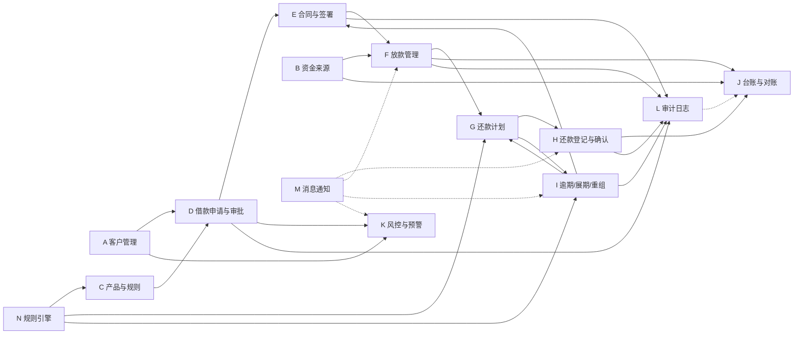
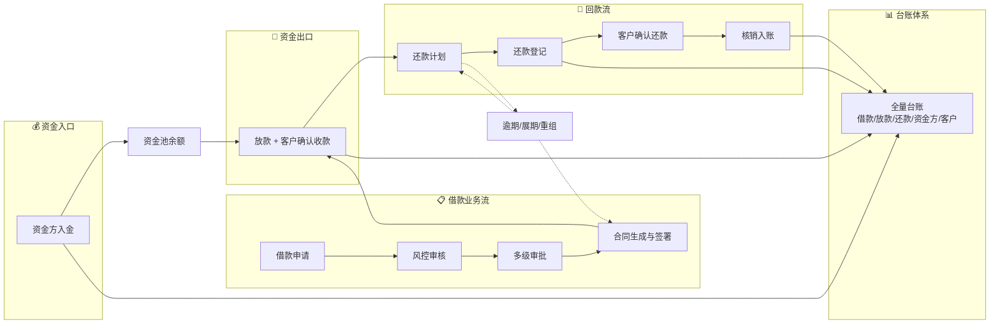

# 借款业务管理系统（Loan Management System）- 完整系统模块图

> 版本：v2.0 | 更新日期：2026-03-17
> 本系统为非银行场景借款管理平台，目标：**全流程闭环、资金可追溯、客户双向确认、规则引擎驱动、完整审计留痕。**

---

## 1. 系统总体架构图

```mermaid
flowchart TB
    subgraph 接入层["接入层 (Access Layer)"]
        WEB["🖥️ Web 管理后台<br/>Next.js + shadcn/ui<br/>桌面 + 响应式移动端"]
        CLIENT["📱 客户端门户<br/>H5 / 响应式 Web<br/>签署、确认、查询"]
        API["🔒 API Gateway<br/>JWT + RBAC 认证<br/>请求限流 / 日志"]
    end

    subgraph 业务中台["业务中台 (Business Core)"]
        subgraph 客户域["A. 客户域"]
            A1["客户档案管理"]
            A2["KYC身份认证"]
            A3["风险标签/黑名单"]
            A4["附件证件管理"]
        end
        subgraph 资金域["B. 资金域"]
            B1["资金方/出资人档案"]
            B2["资金账户管理"]
            B3["入金登记与余额"]
            B4["资金方对账与分润"]
        end
        subgraph 产品域["C. 产品与规则域"]
            C1["借款产品管理"]
            C2["规则引擎<br/>利率/费用/逾期/展期<br/>版本化+生效时间"]
        end
        subgraph 借款域["D-F. 借款全链路"]
            D1["借款申请/费用试算"]
            D2["风控审核"]
            D3["多级审批流"]
            E1["合同模板/变量引擎"]
            E2["电子签署<br/>手写/勾选/短信验证"]
            E3["签署留痕<br/>IP/设备/时间/地点/截图"]
            F1["放款单管理"]
            F2["打款记录/凭证"]
            F3["客户确认收款"]
        end
        subgraph 还款域["G-I. 还款全链路"]
            G1["还款计划自动生成"]
            G2["分期/一次性/提前/部分"]
            G3["计划版本保留"]
            H1["财务登记收款"]
            H2["凭证上传/系统匹配"]
            H3["客户确认还款"]
            H4["争议/人工复核"]
            I1["逾期自动识别"]
            I2["罚息计算(规则引擎)"]
            I3["展期申请/审批"]
            I4["分期重组/补充协议"]
        end
        subgraph 台账域["J. 台账与对账域"]
            J1["借款/放款/还款台账"]
            J2["资金方/客户往来台账"]
            J3["日资金流水"]
            J4["对账差异预警"]
            J5["导出 Excel / PDF"]
        end
        subgraph 风控审计域["K-L. 风控与审计域"]
            K1["逾期/大额/重复借款预警"]
            K2["身份异常/高风险标签"]
            K3["合同修改频繁预警"]
            K4["人工审核备注"]
            L1["全量操作日志"]
            L2["前后值变更记录"]
            L3["禁止物理删除"]
        end
        subgraph 消息配置域["M-N. 消息与配置域"]
            M1["站内信"]
            M2["短信/邮件(预留)"]
            M3["WhatsApp(预留)"]
            N1["系统参数配置"]
            N2["12项可配规则"]
        end
    end

    subgraph 数据层["数据层 (Data Layer)"]
        DB[("🐘 PostgreSQL<br/>28+ 核心表<br/>Prisma ORM")]
        FILE["📁 文件存储<br/>Supabase Storage / S3<br/>合同PDF/签名/凭证/附件"]
        CACHE["⚡ 缓存层(可选)<br/>Redis / 内存<br/>会话/规则缓存"]
    end

    subgraph 基础设施["基础设施 (Infrastructure)"]
        DEPLOY["🚀 部署<br/>Vercel + Supabase<br/>或独立服务器"]
        CRON["⏰ 定时任务<br/>逾期检查/提醒<br/>对账差异扫描"]
        LOG["📊 日志 & 监控<br/>操作审计/性能监控"]
    end

    WEB --> API
    CLIENT --> API
    API --> A1 & A2 & A3 & A4
    API --> B1 & B2 & B3 & B4
    API --> C1 & C2
    API --> D1 & D2 & D3 & E1 & E2 & E3 & F1 & F2 & F3
    API --> G1 & G2 & G3 & H1 & H2 & H3 & H4
    API --> I1 & I2 & I3 & I4
    API --> J1 & J2 & J3 & J4 & J5
    API --> K1 & K2 & K3 & K4
    API --> L1 & L2
    API --> M1 & M2 & M3 & N1 & N2
    业务中台 --> DB
    业务中台 --> FILE
    CRON --> DB
    CRON --> M1
```

---

## 2. 核心模块依赖关系图

---

## 3. 完整模块清单与子功能

### A. 客户管理模块
| 子功能 | 说明 | 核心表 |
|--------|------|--------|
| 客户基本信息 | 姓名、性别、出生日期、联系方式 | customers |
| 身份信息 / KYC | 证件类型/号码、护照、居留证、认证状态 | customers, customer_kyc |
| 联系方式 | 手机、邮箱、通讯地址 | customers |
| 紧急联系人 | 姓名、电话、关系 | customers |
| 地址 & 工作信息 | 常住地址、工作单位、职位、月收入 | customers |
| 历史借款记录 | 关联所有 loan_applications 及状态 | loan_applications |
| 风险标签 | 高风险、频繁借款、逾期历史等标签 | customers.risk_tags |
| 黑名单 / 观察名单 | 禁止借款 / 需人工审核 | customers.is_blacklist/is_watchlist |
| 附件上传 | 证件照、工资单、聊天记录、担保材料 | attachments |

### B. 资金来源管理模块
| 子功能 | 说明 | 核心表 |
|--------|------|--------|
| 资金方档案 | 出资人基本信息、银行账户、协议 | funders |
| 资金账户管理 | 账户余额、币种、状态（活跃/冻结/关闭） | fund_accounts |
| 入金登记 | 每笔入金金额、时间、凭证、操作人 | capital_inflows |
| 资金余额 | 实时余额 = 入金 - 出金（放款） | fund_accounts.balance |
| 资金使用去向 | 每笔资金对应哪些放款 | disbursements.fund_account_id |
| 资金收益统计 | 利息 + 费用收入汇总 | 计算字段(台账聚合) |
| 资金方对账单 | 入金/出金/收益/余额 | ledger_entries |
| 资金方分润结算 | 按约定比例分润 | fund_profit_shares(新增) |

### C. 借款产品与规则模块
| 子功能 | 说明 | 核心表 |
|--------|------|--------|
| 多种借款产品 | 期限/金额/还款方式可配 | loan_products |
| 利率 / 服务费 / 管理费 | 固定 / 阶梯 / 按天/周/月 | pricing_rules |
| 逾期费 / 展期费 / 违约金 | 独立规则、宽限期可配 | pricing_rules |
| 提前还款规则 | 是否允许、是否收费 | pricing_rules |
| 分期还款规则 | 等额本息 / 等额本金 / 先息后本 | pricing_rules |
| 规则版本化 | 历史合同不受新规则影响 | pricing_rules.version + effective_from/to |
| 规则启用 / 停用 | is_active 开关 | pricing_rules.is_active |

### D. 借款申请与审批模块
| 子功能 | 说明 | 核心表 |
|--------|------|--------|
| 创建借款申请 | 金额、期限、用途、还款方式 | loan_applications |
| 费用试算 | 规则引擎自动计算各项费用 | loan_applications.fee_trial_json |
| 风控审核 | 风控人员审查客户资质 | loan_approvals(level=1) |
| 多级审批 | 支持1-N级审批链 | loan_approvals |
| 审批意见留痕 | 通过/驳回/退回+评论 | loan_approvals.comment |
| 驳回/补件/重提 | 状态回退、修改后重新提交 | state machine |
| 大额二次审核 | 超过阈值自动增加审批层级 | system_settings |

### E. 合同模板与电子签署模块
| 子功能 | 说明 | 核心表 |
|--------|------|--------|
| 合同模板管理 | HTML 模板 + 变量占位符 | contract_templates |
| 模板变量引擎 | `{{客户姓名}}` `{{借款金额}}` 等 14+ 变量 | contract_engine |
| 自动生成合同 | 审批通过 → 填充变量 → HTML/PDF | contracts.snapshot_html |
| 在线签字 | 手写签名 Canvas + 触摸支持 | signatures |
| 多种确认方式 | 手写签名 / 勾选确认 / 短信验证码 | signatures.sign_action |
| 签署留痕 | 时间、地点、IP、设备、浏览器、截图 | signatures |
| 合同版本管理 | 版本号递增、历史快照不可修改 | contracts.version |
| 附件归档 | 合同 PDF、签名图片归档 | attachments |

### F. 放款管理模块
| 子功能 | 说明 | 核心表 |
|--------|------|--------|
| 生成放款单 | 合同签署完成自动触发 | disbursements |
| 记录核心金额 | 应放金额、扣费、实际到账 | disbursements |
| 打款信息 | 打款账户、收款账户、时间、操作人 | disbursements |
| 打款凭证 | 上传银行凭证截图 | disbursements.proof_url |
| 客户确认收款 | 客户端确认"已收到款项" | disbursements.customer_confirmed_at |
| 分笔放款 | 一笔借款多次出账 | 多条 disbursement 记录 |
| 触发还款计划 | 放款确认后自动生成 | repayment_plans |

### G. 还款计划模块
| 子功能 | 说明 | 核心表 |
|--------|------|--------|
| 自动生成计划表 | 放款后按规则生成 | repayment_plans |
| 多种还款方式 | 一次性 / 分期 / 提前 / 部分 / 展期 | repayment_schedule_items |
| 每期明细 | 本金/利息/费用/罚息/应还合计 | repayment_schedule_items |
| 已还跟踪 | principal_paid / interest_paid 等 | repayment_schedule_items |
| 计划重算 | 展期/重组后生成新版本 | repayment_plans.version |
| 原始计划保留 | 历史版本 status→superseded | repayment_plans.status |

### H. 还款登记与客户确认模块
| 子功能 | 说明 | 核心表 |
|--------|------|--------|
| 财务登记收款 | 金额、时间、方式 | repayments |
| 多种收款方式 | 现金/转账/第三方代付/线下 | repayments.pay_type |
| 上传凭证 | 还款凭证图片/PDF | repayments.proof_url |
| 系统自动匹配 | 匹配对应借款单和期次 | repayment_allocations |
| 客户确认金额 | 确认"本次还款金额" | repayment_confirmations.confirmed_amount |
| 客户确认对应 | 确认"对应哪一笔借款" | repayment_confirmations.confirmed_usage |
| 部分还款 | 支持还一部分 | allocation 分配 |
| 争议状态 | 待确认/已确认/驳回/人工复核 | repayments.status state machine |
| 未确认不完结 | 客户必须确认才能核销 | 流程强制约束 |

### I. 逾期/展期/分期重组模块
| 子功能 | 说明 | 核心表 |
|--------|------|--------|
| 自动识别逾期 | 定时检查 due_date vs 当前日期 | CRON → overdue_records |
| 逾期费用计算 | 规则引擎：宽限期 + 阶梯罚息 | pricing_rules |
| 逾期提醒 | 按配置频率发送通知 | notifications |
| 展期申请 | 客户或业务员发起 | extensions |
| 展期审批 | 审批通过 → 计算展期费 → 补充协议 | extensions + contracts |
| 分期重组 | 生成新还款计划 + 补充协议 | restructures + repayment_plans |
| 所有变更留痕 | 审计日志 + 状态历史 | audit_logs |

### J. 台账与对账模块
| 子功能 | 说明 | 核心表 |
|--------|------|--------|
| 借款台账 | 所有借款申请及状态 | loan_applications |
| 放款台账 | 所有放款记录 | disbursements |
| 还款台账 | 所有还款记录 | repayments |
| 资金方台账 | 每个资金方的入金/出金/收益 | ledger_entries |
| 客户往来台账 | 每个客户的借/还/余额 | ledger_entries |
| 日资金流水 | 每日汇总入金/放款/回款 | ledger_entries 聚合 |
| 每日应收/实收/未收 | 对账核心指标 | schedule_items 聚合 |
| 对账差异预警 | 应收 ≠ 实收 自动预警 | 对比计算 |
| 导出 | Excel / PDF | 服务端生成下载 |

### K. 风控与预警模块
| 子功能 | 说明 |
|--------|------|
| 逾期预警 | 到期前N天提醒 |
| 大额借款预警 | 超过阈值需二次审核 |
| 重复借款预警 | 同一客户短期内多次申请 |
| 身份信息异常 | 证件过期、信息不一致 |
| 高风险客户标签 | 自动/手动标记 |
| 合同修改频繁预警 | 频繁修改金额/合同异常 |
| 人工审核备注 | 风控人员添加备注 |

### L. 审计日志模块
| 子功能 | 说明 |
|--------|------|
| 全量操作日志 | 创建/修改/审批/签署/放款/还款/确认/规则变更 |
| 前后值记录 | old_value / new_value JSON 完整快照 |
| 金额变更特殊标记 | 任何金额变更自动高亮审计 |
| 禁止物理删除 | 核心业务只允许作废/冲正/撤销 |
| 操作人+时间+IP | 完整追责链 |

### M. 客户端门户
| 子功能 | 说明 |
|--------|------|
| 查看合同 | 合同 HTML/PDF 在线查看 |
| 在线签署 | 手写签名 + 确认 |
| 借款记录 | 历史借款列表与状态 |
| 应还/已还/剩余 | 清晰金额展示 |
| 上传还款凭证 | 拍照/上传 |
| 确认已收款 | 确认放款到账 |
| 确认已还款 | 确认还款金额与用途 |
| 消息通知 | 站内信中心 |

### N. 系统设置 / 规则引擎
以下 12 项关键业务规则全部可配置，不写死在代码中：

| # | 规则名称 | 配置方式 | 表 |
|---|---------|---------|---|
| 1 | 利率规则 | 固定/阶梯/日/月费率 | pricing_rules |
| 2 | 服务费/管理费 | 金额比例或固定值 | pricing_rules |
| 3 | 提前还款规则 | 是否允许、手续费 | pricing_rules |
| 4 | 逾期罚息规则 | 宽限期+阶梯罚息率 | pricing_rules |
| 5 | 分期重组规则 | 新期数/新利率 | pricing_rules |
| 6 | 展期规则 | 最大展期天数/费用 | pricing_rules |
| 7 | 最低还款额 | 百分比或固定值 | system_settings |
| 8 | 审批门槛 | 金额/期限阈值 | system_settings |
| 9 | 大额二次审核 | 触发金额阈值 | system_settings |
| 10 | 客户确认超时 | 超时天数/自动提醒 | system_settings |
| 11 | 逾期提醒频率 | 间隔天数/渠道 | system_settings |
| 12 | 合同模板版本 | 版本号+生效时间 | contract_templates |

---

## 4. RBAC 角色与模块访问矩阵

### 4.1 系统角色定义

| # | 角色编码 | 角色名称 | 说明 |
|---|---------|----------|------|
| 1 | super_admin | 超级管理员 | 全部权限，系统配置 |
| 2 | biz_staff | 业务员/客户经理 | 客户录入、借款申请、跟进 |
| 3 | risk_staff | 风控专员 | 风控审核、风险标签、预警处理 |
| 4 | approver | 审批经理 | 借款审批、展期/重组审批 |
| 5 | finance | 财务/出纳 | 放款操作、还款登记、资金管理 |
| 6 | funder_admin | 资金方管理 | 管理自己的资金账户和对账 |
| 7 | legal | 法务/合同管理员 | 合同模板、合同审核 |
| 8 | collection | 催收/跟进专员 | 逾期跟进、催收记录 |
| 9 | client | 客户端用户(借款人) | 签署、确认、查看自己的数据 |
| 10 | auditor | 审计/老板(只读) | 全部报表只读、审计日志 |

### 4.2 权限矩阵

| 模块 | super_admin | biz_staff | risk_staff | approver | finance | funder_admin | legal | collection | client | auditor |
|------|:-----------:|:---------:|:----------:|:--------:|:-------:|:------------:|:-----:|:----------:|:------:|:-------:|
| A.客户管理 | CRUD | CR | R | R | - | - | R | R | 己R | R |
| B.资金管理 | CRUD | - | - | - | CRU | 己方RU | - | - | - | R |
| C.产品规则 | CRUD | R | R | R | - | - | R | - | R | R |
| D.借款申请 | CRUD | CR | 审核 | 审批 | R | R | R | R | 己CR | R |
| E.合同签署 | CRUD | R | R | R | R | R | CRU | R | 己签 | R |
| F.放款管理 | CRUD | R | - | - | CRU | R | R | - | 己确认 | R |
| G.还款计划 | CRUD | R | R | R | R | R | R | R | 己R | R |
| H.还款核销 | CRUD | - | - | - | CRU | - | - | R | 己确认 | R |
| I.逾期重组 | CRUD | 申请 | R | 批 | - | - | R | CRU | 己申请 | R |
| J.台账对账 | R | R | R | R | CRUD | 己方R | R | R | 己R | R |
| K.风控预警 | R | R | CRU | R | - | - | - | CRU | - | R |
| L.审计日志 | R | - | - | - | - | - | - | - | - | R |
| M.消息通知 | CRUD | R | R | R | R | R | R | R | R | R |
| N.系统配置 | CRUD | - | - | - | - | - | - | - | - | R |

> C=Create R=Read U=Update D=Delete；"己"=只能操作自己的数据；"审/批"=审核/审批权限

---

## 5. 数据流总览

---

## 6. 技术栈总览

| 层 | 技术选型 | 说明 |
|----|---------|----|
| 前端框架 | Next.js 14 + React 18 + TypeScript | App Router / SSR |
| UI 组件 | Tailwind CSS + shadcn/ui | 响应式 + 组件库 |
| 后端 API | Next.js API Routes | RESTful |
| 数据库 | PostgreSQL | 金融级数据一致性 |
| ORM | Prisma | 类型安全 + 迁移管理 |
| 认证 | JWT (jose) + RBAC | 无状态令牌 + 角色权限 |
| 文件存储 | Supabase Storage / S3 | 合同/签名/凭证/附件 |
| PDF 生成 | HTML → PDF (puppeteer / jspdf) | 合同电子版 |
| 电子签字 | Canvas 手写 + 审计留痕 | IP/设备/时间/截图 |
| 测试 | Vitest | 单元 + 集成测试 |
| 部署 | Vercel + Supabase 或独立服务器 | 可灵活选择 |
| 定时任务 | Cron / Vercel Cron | 逾期检测/提醒/对账 |

---

## 7. 关键设计原则

1. **流程闭环**：每笔业务必须走完完整状态机，不允许跳跃
2. **资金可追溯**：每一分钱都能追溯来源 → 去向 → 回收
3. **双向确认**：放款需客户确认收款，还款需客户确认金额与用途
4. **规则驱动**：所有费率、费用、逾期规则通过引擎配置，不写死
5. **审计完整**：所有关键操作记录日志，金额变更必写审计
6. **版本保护**：规则、合同、还款计划都有版本号，历史不可篡改
7. **禁止物理删除**：核心业务表只允许状态变更（作废/冲正/撤销）
8. **数据一致性**：金额使用 Decimal(18,4)，事务保证一致
9. **权限清晰**：RBAC 10 种角色，每个模块精确控制
10. **移动优先**：核心流程（签署/确认/查询）响应式适配

以上为完整系统模块图，覆盖全部 14 个业务模块、10 种系统角色、12 项可配规则，指导后续数据库设计、流程实现与代码开发。
