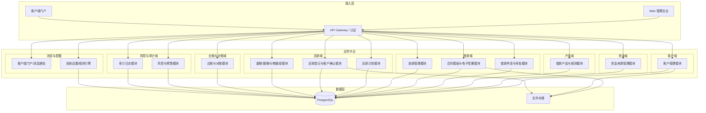
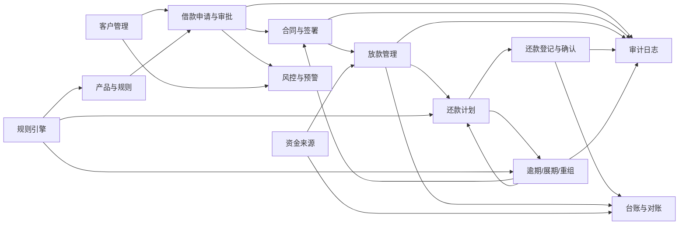
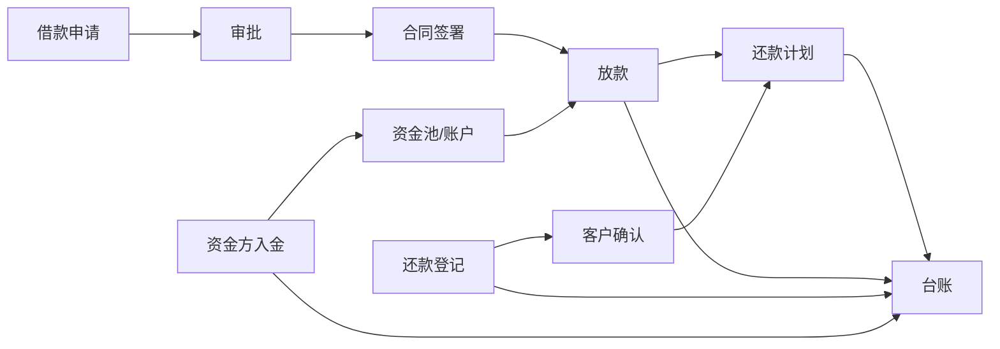

# 借款业务管理系统 - 系统模块图

## 1. 系统总体架构图

---

## 2. 核心模块依赖关系图

---

## 3. 模块清单与职责

| 模块编号 | 模块名称 | 职责简述 | 核心实体 |
|---------|----------|----------|----------|
| A | 客户管理 | 客户档案、KYC、联系方式、紧急联系人、历史借款、风险标签、黑名单、附件 | customers, customer_kyc, attachments |
| B | 资金来源管理 | 资金方档案、资金账户、入金登记、余额、使用去向、收益、对账、分润 | funders, fund_accounts, capital_inflows, ledger_entries |
| C | 借款产品与规则 | 产品定义、期限/利率/费用/逾期费/展期费/违约金、阶梯与版本化规则 | loan_products, pricing_rules |
| D | 借款申请与审批 | 申请创建、费用试算、风控审核、多级审批、意见留痕、驳回补件 | loan_applications, loan_approvals |
| E | 合同模板与电子签署 | 模板管理、变量引擎、PDF 生成、在线签字、时间/地点/IP/设备留痕 | contracts, contract_templates, signatures |
| F | 放款管理 | 放款单、应放/实到、打款账户、凭证、客户确认收款、还款计划触发 | disbursements |
| G | 还款计划 | 计划表生成、一次性/分期/提前/部分/展期、每期明细、版本保留 | repayment_plans, repayment_schedule_items |
| H | 还款登记与客户确认 | 收款登记、凭证、匹配借款、客户确认金额与用途、核销、争议与复核 | repayments, repayment_confirmations |
| I | 逾期/展期/分期重组 | 逾期识别、罚息计算、展期申请、分期重组、补充协议、留痕 | overdue_records, extensions, restructures |
| J | 台账与对账 | 借款/放款/还款/资金方/客户往来台账、日流水、差异预警、导出 | ledger_entries |
| K | 风控与预警 | 逾期/大额/重复/身份异常/高风险标签/合同修改预警、人工备注 | 依赖 A、D、G 数据 |
| L | 审计日志 | 关键操作日志、前后值、无物理删除、可追责 | audit_logs |
| M | 客户端门户 | 合同查看与签署、借款与应还查询、凭证上传、收款/还款确认、消息 | 复用 E、F、G、H、notifications |
| N | 系统设置/规则引擎 | 利率/费用/逾期/展期等规则配置、版本与生效时间 | system_settings, pricing_rules |

---

## 4. 角色与模块访问矩阵（概要）

| 角色 | A | B | C | D | E | F | G | H | I | J | K | L | M |
|------|---|---|---|---|---|---|---|---|---|---|---|---|---|
| 超级管理员 | ✓ | ✓ | ✓ | ✓ | ✓ | ✓ | ✓ | ✓ | ✓ | ✓ | ✓ | ✓ | - |
| 业务员/客户经理 | ✓写 | - | 读 | ✓写 | 读 | 读 | 读 | - | 申请 | 读 | 读 | - | - |
| 风控专员 | ✓读 | - | 读 | ✓审 | 读 | - | 读 | - | 读 | 读 | ✓写 | - | - |
| 审批经理 | ✓读 | - | 读 | ✓批 | 读 | - | 读 | - | 批 | 读 | 读 | - | - |
| 财务/出纳 | - | ✓部分 | - | 读 | 读 | ✓写 | 读 | ✓写 | - | ✓ | - | - | - |
| 资金方管理 | - | ✓己方 | - | 读 | 读 | 读 | 读 | - | - | ✓己方 | - | - | - |
| 法务/合同管理员 | 读 | - | 读 | 读 | ✓写 | 读 | 读 | - | 读 | 读 | - | - | - |
| 催收/跟进专员 | ✓读 | - | - | 读 | 读 | - | ✓读 | 读 | ✓跟进 | 读 | ✓写 | - | - |
| 客户端用户 | 己 | - | 读 | 己申请 | 己签 | 己确认收款 | 己读 | 己确认还款 | 己申请 | 己 | - | - | ✓ |
| 审计/老板 | 读 | 读 | 读 | 读 | 读 | 读 | 读 | 读 | 读 | ✓ | 读 | ✓ | - |

---

## 5. 数据流总览（简化）

以上为系统模块图及模块间关系，用于指导后续 ER 设计、流程与菜单设计。
