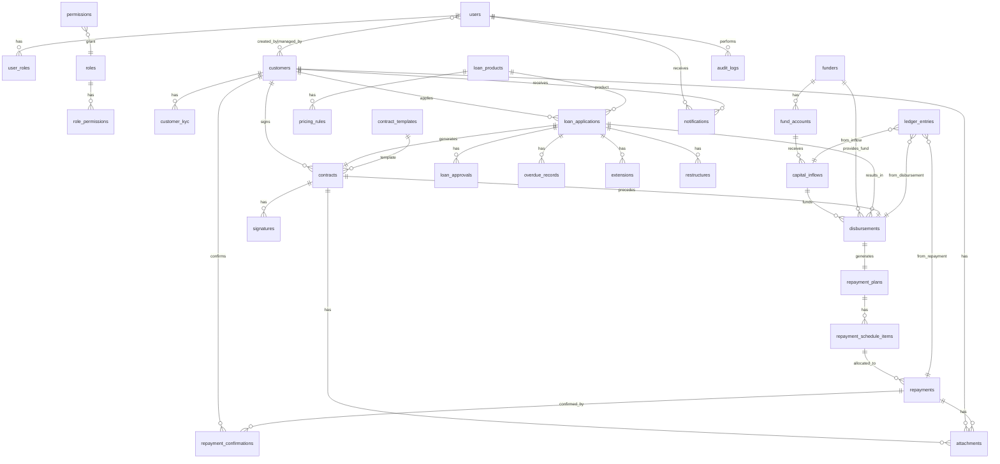

# 借款业务管理系统 - 数据库 ER 设计与表结构

## 1. 实体关系图（Mermaid ER）

---

## 2. 表结构说明与字段建议

### 2.1 用户与权限

#### users
| 字段 | 类型 | 说明 |
|------|------|------|
| id | UUID PK | 主键 |
| username | VARCHAR(64) UNIQUE | 登录名 |
| password_hash | VARCHAR(255) | 密码哈希 |
| email | VARCHAR(255) | 邮箱 |
| phone | VARCHAR(32) | 手机 |
| real_name | VARCHAR(64) | 真实姓名 |
| avatar_url | VARCHAR(512) | 头像 |
| is_active | BOOLEAN | 是否启用 |
| is_client | BOOLEAN | 是否客户端用户（借款人） |
| customer_id | UUID FK nullable | 若为客户端用户则关联 customer |
| last_login_at | TIMESTAMP | 最后登录时间 |
| created_at | TIMESTAMP | 创建时间 |
| updated_at | TIMESTAMP | 更新时间 |
| deleted_at | TIMESTAMP nullable | 软删除 |

#### roles
| 字段 | 类型 | 说明 |
|------|------|------|
| id | UUID PK | 主键 |
| code | VARCHAR(32) UNIQUE | 角色编码 super_admin, biz_staff, risk_staff, approver, finance, funder_admin, legal, collection, client, auditor |
| name | VARCHAR(64) | 角色名称 |
| description | TEXT | 描述 |
| created_at, updated_at | TIMESTAMP | |

#### permissions
| 字段 | 类型 | 说明 |
|------|------|------|
| id | UUID PK | 主键 |
| code | VARCHAR(64) UNIQUE | 权限编码 resource:action |
| name | VARCHAR(64) | 名称 |
| module | VARCHAR(32) | 所属模块 |
| created_at, updated_at | TIMESTAMP | |

#### user_roles
| 字段 | 类型 | 说明 |
|------|------|------|
| id | UUID PK | 主键 |
| user_id | UUID FK | 用户 |
| role_id | UUID FK | 角色 |
| scope_json | JSONB nullable | 数据范围（如资金方ID） |
| created_at | TIMESTAMP | |

#### role_permissions
| 字段 | 类型 | 说明 |
|------|------|------|
| role_id | UUID FK | 角色 |
| permission_id | UUID FK | 权限 |
| PRIMARY KEY(role_id, permission_id) | | |

---

### 2.2 客户

#### customers
| 字段 | 类型 | 说明 |
|------|------|------|
| id | UUID PK | 主键 |
| customer_no | VARCHAR(32) UNIQUE | 客户编号 |
| name | VARCHAR(64) | 姓名 |
| id_type | VARCHAR(16) | 证件类型 ID_CARD, PASSPORT |
| id_number | VARCHAR(64) | 证件号 |
| phone | VARCHAR(32) | 手机 |
| email | VARCHAR(255) | 邮箱 |
| gender | VARCHAR(8) | 性别 |
| birth_date | DATE | 出生日期 |
| address | TEXT | 常住地址 |
| work_company | VARCHAR(128) | 工作单位 |
| work_position | VARCHAR(64) | 职位 |
| income_monthly | DECIMAL(18,2) | 月收入 |
| emergency_contact_name | VARCHAR(64) | 紧急联系人姓名 |
| emergency_contact_phone | VARCHAR(32) | 紧急联系人电话 |
| risk_tags | VARCHAR(128)[] | 风险标签 |
| is_blacklist | BOOLEAN | 是否黑名单 |
| is_watchlist | BOOLEAN | 是否观察名单 |
| status | VARCHAR(20) | 状态 active, inactive, blocked |
| created_by | UUID FK | 创建人 |
| updated_at | TIMESTAMP | 更新时间 |
| version | INT | 版本号 |
| deleted_at | TIMESTAMP nullable | 软删除 |

#### customer_kyc
| 字段 | 类型 | 说明 |
|------|------|------|
| id | UUID PK | 主键 |
| customer_id | UUID FK | 客户 |
| kyc_type | VARCHAR(32) | 类型 identity, income, address |
| verified_at | TIMESTAMP | 认证时间 |
| verified_by | UUID FK | 认证人 |
| result | VARCHAR(16) | pass, reject, pending |
| remark | TEXT | 备注 |
| created_at, updated_at | TIMESTAMP | |

---

### 2.3 资金方与资金

#### funders
| 字段 | 类型 | 说明 |
|------|------|------|
| id | UUID PK | 主键 |
| funder_no | VARCHAR(32) UNIQUE | 资金方编号 |
| name | VARCHAR(128) | 名称 |
| contact_name | VARCHAR(64) | 联系人 |
| contact_phone | VARCHAR(32) | 联系电话 |
| bank_name | VARCHAR(128) | 开户行 |
| bank_account | VARCHAR(64) | 银行账号 |
| agreement_doc_url | VARCHAR(512) | 协议附件 |
| status | VARCHAR(20) | active, inactive |
| created_at, updated_at | TIMESTAMP | |

#### fund_accounts
| 字段 | 类型 | 说明 |
|------|------|------|
| id | UUID PK | 主键 |
| funder_id | UUID FK | 资金方 |
| account_no | VARCHAR(32) UNIQUE | 账户编号 |
| balance | DECIMAL(18,4) | 当前余额 |
| currency | VARCHAR(8) | 币种 |
| status | VARCHAR(20) | active, frozen, closed |
| created_at, updated_at | TIMESTAMP | |

#### capital_inflows
| 字段 | 类型 | 说明 |
|------|------|------|
| id | UUID PK | 主键 |
| fund_account_id | UUID FK | 资金账户 |
| inflow_no | VARCHAR(32) UNIQUE | 入金单号 |
| amount | DECIMAL(18,4) | 入金金额 |
| inflow_time | TIMESTAMP | 入金时间 |
| proof_url | VARCHAR(512) | 凭证 |
| operator_id | UUID FK | 操作人 |
| remark | TEXT | 备注 |
| created_at | TIMESTAMP | |

---

### 2.4 产品与规则

#### loan_products
| 字段 | 类型 | 说明 |
|------|------|------|
| id | UUID PK | 主键 |
| product_code | VARCHAR(32) UNIQUE | 产品编码 |
| name | VARCHAR(128) | 产品名称 |
| term_unit | VARCHAR(8) | 期限单位 day, week, month |
| min_term | INT | 最小期限 |
| max_term | INT | 最大期限 |
| min_amount | DECIMAL(18,4) | 最小金额 |
| max_amount | DECIMAL(18,4) | 最大金额 |
| repayment_type | VARCHAR(20) | 还款方式 one_time, installments, bullet |
| status | VARCHAR(20) | active, inactive |
| version | INT | 版本号 |
| effective_from | TIMESTAMP | 生效开始 |
| effective_to | TIMESTAMP nullable | 生效结束 |
| created_at, updated_at | TIMESTAMP | |

#### pricing_rules
| 字段 | 类型 | 说明 |
|------|------|------|
| id | UUID PK | 主键 |
| product_id | UUID FK | 产品（可空表示全局） |
| rule_type | VARCHAR(32) | interest, service_fee, overdue_fee, extension_fee, penalty, early_repay |
| rule_name | VARCHAR(64) | 规则名称 |
| calc_type | VARCHAR(16) | fixed, tiered, daily, monthly |
| value_json | JSONB | 费率/阶梯等，如 {"rate":"0.01","basis":"principal"} |
| priority | INT | 优先级 |
| effective_from | TIMESTAMP | 生效开始 |
| effective_to | TIMESTAMP nullable | 生效结束 |
| is_active | BOOLEAN | 是否启用 |
| version | INT | 版本号 |
| created_at, updated_at | TIMESTAMP | |

---

### 2.5 借款申请与审批

#### loan_applications
| 字段 | 类型 | 说明 |
|------|------|------|
| id | UUID PK | 主键 |
| application_no | VARCHAR(32) UNIQUE | 申请单号 |
| customer_id | UUID FK | 客户 |
| product_id | UUID FK | 产品 |
| amount | DECIMAL(18,4) | 申请金额 |
| term_value | INT | 期限数值 |
| term_unit | VARCHAR(8) | 期限单位 |
| purpose | VARCHAR(128) | 借款用途 |
| repayment_type | VARCHAR(20) | 还款方式 |
| status | VARCHAR(32) | draft, pending_risk, risk_rejected, pending_approval, approved, rejected, contracted, disbursed |
| fee_trial_json | JSONB | 费用试算结果快照 |
| created_by | UUID FK | 创建人 |
| submitted_at | TIMESTAMP nullable | 提交时间 |
| version | INT | 版本号 |
| created_at, updated_at | TIMESTAMP | |

#### loan_approvals
| 字段 | 类型 | 说明 |
|------|------|------|
| id | UUID PK | 主键 |
| application_id | UUID FK | 申请单 |
| approval_level | INT | 审批层级 |
| approver_id | UUID FK | 审批人 |
| result | VARCHAR(16) | pass, reject, return |
| comment | TEXT | 审批意见 |
| approved_at | TIMESTAMP | 审批时间 |
| created_at | TIMESTAMP | |

---

### 2.6 合同与签署

#### contract_templates
| 字段 | 类型 | 说明 |
|------|------|------|
| id | UUID PK | 主键 |
| template_code | VARCHAR(32) UNIQUE | 模板编码 |
| name | VARCHAR(128) | 模板名称 |
| content_html | TEXT | HTML 内容（含变量占位符） |
| variables_schema | JSONB | 变量定义与校验 |
| version | INT | 版本号 |
| is_active | BOOLEAN | 是否启用 |
| effective_from | TIMESTAMP | 生效开始 |
| created_at, updated_at | TIMESTAMP | |

#### contracts
| 字段 | 类型 | 说明 |
|------|------|------|
| id | UUID PK | 主键 |
| contract_no | VARCHAR(32) UNIQUE | 合同编号 |
| application_id | UUID FK | 借款申请 |
| template_id | UUID FK | 使用的模板版本 |
| snapshot_html | TEXT | 生成时 HTML 快照 |
| snapshot_pdf_url | VARCHAR(512) | 生成 PDF 存储路径 |
| variables_snapshot | JSONB | 签约时变量快照 |
| status | VARCHAR(20) | draft, pending_sign, signed, cancelled |
| signed_at | TIMESTAMP nullable | 签署完成时间 |
| version | INT | 版本号 |
| created_at, updated_at | TIMESTAMP | |

#### signatures
| 字段 | 类型 | 说明 |
|------|------|------|
| id | UUID PK | 主键 |
| contract_id | UUID FK | 合同 |
| signer_type | VARCHAR(16) | customer, company, witness |
| signer_user_id | UUID FK nullable | 系统用户 |
| signer_customer_id | UUID FK nullable | 客户 |
| sign_action | VARCHAR(32) | handwrite, checkbox, sms_verify, e_sign |
| sign_data | JSONB | 手写坐标/勾选项/验证码流水号等 |
| sign_image_url | VARCHAR(512) | 签名图片/截图 |
| signed_at | TIMESTAMP | 签署时间 |
| ip_address | VARCHAR(45) | IP |
| device_info | VARCHAR(256) | 设备信息 |
| geo_location | VARCHAR(128) | 地点 |
| user_agent | VARCHAR(512) | User-Agent |
| created_at | TIMESTAMP | |

---

### 2.7 放款

#### disbursements
| 字段 | 类型 | 说明 |
|------|------|------|
| id | UUID PK | 主键 |
| disbursement_no | VARCHAR(32) UNIQUE | 放款单号 |
| application_id | UUID FK | 借款申请 |
| contract_id | UUID FK | 合同 |
| fund_account_id | UUID FK | 出资账户 |
| capital_inflow_id | UUID FK nullable | 若从某笔入金直接划转可关联 |
| amount_expected | DECIMAL(18,4) | 应放金额 |
| amount_fee_deduct | DECIMAL(18,4) | 扣费金额 |
| amount_actual | DECIMAL(18,4) | 实际到账金额 |
| payee_account | VARCHAR(64) | 收款账户 |
| payee_name | VARCHAR(64) | 收款人姓名 |
| payee_bank | VARCHAR(128) | 收款银行 |
| paid_at | TIMESTAMP | 打款时间 |
| proof_url | VARCHAR(512) | 打款凭证 |
| operator_id | UUID FK | 操作人 |
| status | VARCHAR(20) | pending, paid, confirmed, cancelled |
| customer_confirmed_at | TIMESTAMP nullable | 客户确认收款时间 |
| version | INT | 版本号 |
| created_at, updated_at | TIMESTAMP | |

---

### 2.8 还款计划与还款

#### repayment_plans
| 字段 | 类型 | 说明 |
|------|------|------|
| id | UUID PK | 主键 |
| application_id | UUID FK | 借款申请 |
| disbursement_id | UUID FK | 放款单 |
| plan_no | VARCHAR(32) UNIQUE | 计划编号 |
| total_principal | DECIMAL(18,4) | 总本金 |
| total_interest | DECIMAL(18,4) | 总利息 |
| total_fees | DECIMAL(18,4) | 总费用 |
| total_amount | DECIMAL(18,4) | 应还总额 |
| version | INT | 计划版本（重算递增） |
| status | VARCHAR(20) | active, superseded, completed |
| created_at, updated_at | TIMESTAMP | |

#### repayment_schedule_items
| 字段 | 类型 | 说明 |
|------|------|------|
| id | UUID PK | 主键 |
| plan_id | UUID FK | 还款计划 |
| period_no | INT | 期序 |
| due_date | DATE | 到期日 |
| principal_due | DECIMAL(18,4) | 应还本金 |
| interest_due | DECIMAL(18,4) | 应还利息 |
| fee_due | DECIMAL(18,4) | 应还费用 |
| overdue_due | DECIMAL(18,4) | 应还罚息/违约金 |
| total_due | DECIMAL(18,4) | 当期应还合计 |
| principal_paid | DECIMAL(18,4) | 已还本金 |
| interest_paid | DECIMAL(18,4) | 已还利息 |
| fee_paid | DECIMAL(18,4) | 已还费用 |
| overdue_paid | DECIMAL(18,4) | 已还罚息 |
| status | VARCHAR(20) | pending, partial, paid, overdue |
| created_at, updated_at | TIMESTAMP | |

#### repayments
| 字段 | 类型 | 说明 |
|------|------|------|
| id | UUID PK | 主键 |
| repayment_no | VARCHAR(32) UNIQUE | 还款单号 |
| application_id | UUID FK | 借款申请 |
| amount | DECIMAL(18,4) | 还款金额 |
| pay_type | VARCHAR(20) | cash, transfer, third_party, offline |
| paid_at | TIMESTAMP | 到账/登记时间 |
| proof_url | VARCHAR(512) | 凭证 |
| operator_id | UUID FK | 登记人 |
| status | VARCHAR(20) | registered, matched, pending_confirm, confirmed, rejected, manual_review |
| customer_confirmed_at | TIMESTAMP nullable | 客户确认时间 |
| version | INT | 版本号 |
| created_at, updated_at | TIMESTAMP | |

#### repayment_allocations
| 字段 | 类型 | 说明 |
|------|------|------|
| id | UUID PK | 主键 |
| repayment_id | UUID FK | 还款单 |
| schedule_item_id | UUID FK | 计划项 |
| principal_amount | DECIMAL(18,4) | 分配本金 |
| interest_amount | DECIMAL(18,4) | 分配利息 |
| fee_amount | DECIMAL(18,4) | 分配费用 |
| overdue_amount | DECIMAL(18,4) | 分配罚息 |
| created_at | TIMESTAMP | |

#### repayment_confirmations
| 字段 | 类型 | 说明 |
|------|------|------|
| id | UUID PK | 主键 |
| repayment_id | UUID FK | 还款单 |
| customer_id | UUID FK | 客户 |
| confirmed_amount | DECIMAL(18,4) | 客户确认金额 |
| confirmed_usage | VARCHAR(64) | 确认用途说明/对应借款 |
| result | VARCHAR(16) | confirmed, rejected |
| confirmed_at | TIMESTAMP | 确认时间 |
| ip_address | VARCHAR(45) | IP |
| device_info | VARCHAR(256) | 设备 |
| created_at | TIMESTAMP | |

---

### 2.9 逾期、展期、重组

#### overdue_records
| 字段 | 类型 | 说明 |
|------|------|------|
| id | UUID PK | 主键 |
| application_id | UUID FK | 借款申请 |
| schedule_item_id | UUID FK nullable | 对应期次 |
| overdue_start_date | DATE | 逾期开始日 |
| overdue_days | INT | 逾期天数 |
| overdue_fee_amount | DECIMAL(18,4) | 逾期费用金额 |
| status | VARCHAR(20) | active, cleared, restructured |
| cleared_at | TIMESTAMP nullable | 结清时间 |
| created_at, updated_at | TIMESTAMP | |

#### extensions
| 字段 | 类型 | 说明 |
|------|------|------|
| id | UUID PK | 主键 |
| application_id | UUID FK | 借款申请 |
| extension_no | VARCHAR(32) UNIQUE | 展期单号 |
| extend_days | INT | 展期天数 |
| extension_fee | DECIMAL(18,4) | 展期费 |
| supplement_contract_id | UUID FK nullable | 补充协议合同 |
| status | VARCHAR(20) | pending, approved, rejected, effective |
| approved_by | UUID FK | 审批人 |
| approved_at | TIMESTAMP | 审批时间 |
| created_at, updated_at | TIMESTAMP | |

#### restructures
| 字段 | 类型 | 说明 |
|------|------|------|
| id | UUID PK | 主键 |
| application_id | UUID FK | 借款申请 |
| restructure_no | VARCHAR(32) UNIQUE | 重组单号 |
| new_plan_id | UUID FK | 新还款计划 |
| supplement_contract_id | UUID FK nullable | 补充协议 |
| status | VARCHAR(20) | pending, approved, rejected, effective |
| approved_by | UUID FK | 审批人 |
| approved_at | TIMESTAMP | 审批时间 |
| created_at, updated_at | TIMESTAMP | |

---

### 2.10 台账与审计

#### ledger_entries
| 字段 | 类型 | 说明 |
|------|------|------|
| id | UUID PK | 主键 |
| entry_no | VARCHAR(32) UNIQUE | 台账流水号 |
| entry_type | VARCHAR(32) | inflow, disbursement, repayment, transfer, adjustment |
| fund_account_id | UUID FK nullable | 资金账户 |
| related_entity_type | VARCHAR(32) | capital_inflow, disbursement, repayment |
| related_entity_id | UUID | 关联业务主键 |
| amount | DECIMAL(18,4) | 金额（正入负出） |
| balance_after | DECIMAL(18,4) | 变动后余额（可选） |
| biz_date | DATE | 业务日期 |
| remark | TEXT | 备注 |
| created_at | TIMESTAMP | |

#### audit_logs
| 字段 | 类型 | 说明 |
|------|------|------|
| id | UUID PK | 主键 |
| user_id | UUID FK nullable | 操作人 |
| action | VARCHAR(64) | 操作类型 create, update, delete, approve, sign, confirm |
| entity_type | VARCHAR(64) | 实体类型 |
| entity_id | UUID | 实体主键 |
| old_value | JSONB nullable | 变更前（敏感字段可脱敏） |
| new_value | JSONB nullable | 变更后 |
| ip_address | VARCHAR(45) | IP |
| user_agent | VARCHAR(512) | User-Agent |
| created_at | TIMESTAMP | |

---

### 2.11 附件、通知、配置

#### attachments
| 字段 | 类型 | 说明 |
|------|------|------|
| id | UUID PK | 主键 |
| entity_type | VARCHAR(32) | customer, contract, repayment, kyc |
| entity_id | UUID | 关联主键 |
| file_name | VARCHAR(256) | 文件名 |
| file_url | VARCHAR(512) | 存储路径 |
| file_size | BIGINT | 大小 |
| mime_type | VARCHAR(64) | MIME |
| uploaded_by | UUID FK | 上传人 |
| created_at | TIMESTAMP | |

#### notifications
| 字段 | 类型 | 说明 |
|------|------|------|
| id | UUID PK | 主键 |
| user_id | UUID FK nullable | 接收用户 |
| customer_id | UUID FK nullable | 接收客户 |
| channel | VARCHAR(16) | sms, email, whatsapp, in_app |
| title | VARCHAR(128) | 标题 |
| content | TEXT | 内容 |
| related_entity_type | VARCHAR(32) | 关联类型 |
| related_entity_id | UUID | 关联主键 |
| sent_at | TIMESTAMP nullable | 发送时间 |
| read_at | TIMESTAMP nullable | 已读时间 |
| created_at | TIMESTAMP | |

#### system_settings
| 字段 | 类型 | 说明 |
|------|------|------|
| id | UUID PK | 主键 |
| key | VARCHAR(64) UNIQUE | 配置键 |
| value | JSONB | 配置值 |
| description | VARCHAR(256) | 说明 |
| category | VARCHAR(32) | 分类 rate, fee, approval, notification, contract |
| updated_by | UUID FK | 更新人 |
| updated_at | TIMESTAMP | |

---

## 3. 关键约束与索引建议

- 所有金额字段：`DECIMAL(18,4)`，避免浮点。
- 业务单号（application_no, contract_no, disbursement_no, repayment_no 等）：UNIQUE + 索引。
- 状态 + 时间组合索引：便于台账与报表（如 status + created_at）。
- 关联查询：所有 FK 建索引；ledger_entries 的 (fund_account_id, biz_date)、(related_entity_type, related_entity_id)。
- 审计：audit_logs 的 (entity_type, entity_id)、(user_id, created_at)。
- 核心业务表（loan_applications, contracts, disbursements, repayments）不做物理删除，仅软删除或状态作废，并写 audit_logs。

以上为完整 ER 与表结构建议，可直接映射到 Prisma Schema。
