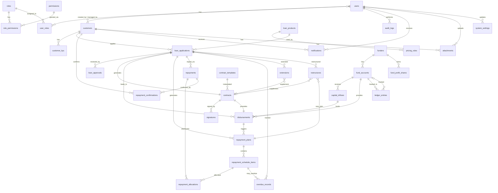

# 借款业务管理系统 - 完整数据库 ER 设计与表结构

> 版本：v2.0 | 更新日期：2026-03-17
> 32 核心数据表，覆盖客户、资金、产品、借款、合同、放款、还款、逾期、台账、审计全部业务域。

---

## 1. 实体关系图（ER Diagram）



---

## 2. 完整表结构说明

### 2.1 用户与权限域（5 表）

#### users — 系统用户表
| 字段 | 类型 | 约束 | 说明 |
|------|------|------|------|
| id | UUID | PK | 主键 |
| username | VARCHAR(64) | UNIQUE NOT NULL | 登录名 |
| password_hash | VARCHAR(255) | NOT NULL | 密码哈希（bcrypt） |
| email | VARCHAR(255) | | 邮箱 |
| phone | VARCHAR(32) | | 手机号 |
| real_name | VARCHAR(64) | | 真实姓名 |
| avatar_url | VARCHAR(512) | | 头像地址 |
| is_active | BOOLEAN | DEFAULT true | 是否启用 |
| is_client | BOOLEAN | DEFAULT false | 是否为客户端用户（借款人） |
| customer_id | UUID | FK → customers UNIQUE NULLABLE | 若为借款人，关联客户记录 |
| last_login_at | TIMESTAMP | NULLABLE | 最后登录时间 |
| created_at | TIMESTAMP | DEFAULT now() | 创建时间 |
| updated_at | TIMESTAMP | ON UPDATE | 更新时间 |
| deleted_at | TIMESTAMP | NULLABLE | 软删除时间 |

#### roles — 角色表
| 字段 | 类型 | 约束 | 说明 |
|------|------|------|------|
| id | UUID | PK | 主键 |
| code | VARCHAR(32) | UNIQUE NOT NULL | 角色编码：super_admin / biz_staff / risk_staff / approver / finance / funder_admin / legal / collection / client / auditor |
| name | VARCHAR(64) | NOT NULL | 角色名称（中文） |
| description | TEXT | | 描述 |
| created_at | TIMESTAMP | | |
| updated_at | TIMESTAMP | | |

#### permissions — 权限表
| 字段 | 类型 | 约束 | 说明 |
|------|------|------|------|
| id | UUID | PK | 主键 |
| code | VARCHAR(64) | UNIQUE NOT NULL | 权限编码 格式：`resource:action`，如 `customer:create` |
| name | VARCHAR(64) | NOT NULL | 权限名称 |
| module | VARCHAR(32) | | 所属模块 A-N |
| created_at | TIMESTAMP | | |
| updated_at | TIMESTAMP | | |

#### user_roles — 用户-角色关联
| 字段 | 类型 | 约束 | 说明 |
|------|------|------|------|
| id | UUID | PK | 主键 |
| user_id | UUID | FK → users | 用户 |
| role_id | UUID | FK → roles | 角色 |
| scope_json | JSONB | NULLABLE | 数据范围限制 `{"funder_id":"xxx"}` |
| created_at | TIMESTAMP | | |
| | | UNIQUE(user_id, role_id) | 同一用户同一角色不重复 |

#### role_permissions — 角色-权限关联
| 字段 | 类型 | 约束 | 说明 |
|------|------|------|------|
| role_id | UUID | FK → roles | 角色 |
| permission_id | UUID | FK → permissions | 权限 |
| | | PK(role_id, permission_id) | 联合主键 |

---

### 2.2 客户域（2 表）

#### customers — 客户主表
| 字段 | 类型 | 约束 | 说明 |
|------|------|------|------|
| id | UUID | PK | 主键 |
| customer_no | VARCHAR(32) | UNIQUE NOT NULL | 客户编号 `CUST-YYYYMMDD-XXXX` |
| name | VARCHAR(64) | NOT NULL | 姓名 |
| id_type | VARCHAR(16) | | 证件类型：ID_CARD / PASSPORT / RESIDENCE |
| id_number | VARCHAR(64) | | 证件号码 |
| phone | VARCHAR(32) | | 手机号 |
| email | VARCHAR(255) | | 邮箱 |
| gender | VARCHAR(8) | | male / female / other |
| birth_date | DATE | | 出生日期 |
| address | TEXT | | 常住地址 |
| work_company | VARCHAR(128) | | 工作单位 |
| work_position | VARCHAR(64) | | 职位 |
| income_monthly | DECIMAL(18,2) | | 月收入 |
| emergency_contact_name | VARCHAR(64) | | 紧急联系人姓名 |
| emergency_contact_phone | VARCHAR(32) | | 紧急联系人电话 |
| emergency_contact_relation | VARCHAR(32) | | 紧急联系人关系 |
| passport_number | VARCHAR(64) | | 护照号码 |
| passport_expiry | DATE | | 护照有效期 |
| passport_country | VARCHAR(64) | | 护照签发国 |
| residence_type | VARCHAR(32) | | 居留类型 |
| residence_number | VARCHAR(64) | | 居留号码 |
| residence_expiry | DATE | | 居留有效期 |
| risk_tags | VARCHAR(128)[] | DEFAULT [] | 风险标签数组 |
| is_blacklist | BOOLEAN | DEFAULT false | 是否黑名单（禁止借款） |
| is_watchlist | BOOLEAN | DEFAULT false | 是否观察名单（需额外审核） |
| status | VARCHAR(20) | DEFAULT 'active' | active / inactive / blocked |
| created_by | UUID | FK → users NULLABLE | 创建人（业务员） |
| version | INT | DEFAULT 1 | 版本号（乐观锁） |
| updated_at | TIMESTAMP | | |
| deleted_at | TIMESTAMP | NULLABLE | 软删除 |

#### customer_kyc — KYC认证记录
| 字段 | 类型 | 约束 | 说明 |
|------|------|------|------|
| id | UUID | PK | 主键 |
| customer_id | UUID | FK → customers | 客户 |
| kyc_type | VARCHAR(32) | NOT NULL | identity / income / address / employment |
| document_url | VARCHAR(512) | | 认证材料URL |
| verified_at | TIMESTAMP | NULLABLE | 认证通过时间 |
| verified_by | UUID | FK → users NULLABLE | 认证人 |
| result | VARCHAR(16) | | pass / reject / pending |
| remark | TEXT | | 备注 |
| expires_at | TIMESTAMP | NULLABLE | 认证有效期 |
| created_at | TIMESTAMP | | |
| updated_at | TIMESTAMP | | |

---

### 2.3 资金方与资金域（4 表）

#### funders — 资金方/出资人
| 字段 | 类型 | 约束 | 说明 |
|------|------|------|------|
| id | UUID | PK | 主键 |
| funder_no | VARCHAR(32) | UNIQUE NOT NULL | 资金方编号 |
| name | VARCHAR(128) | NOT NULL | 名称 |
| type | VARCHAR(32) | | individual / company / institution |
| contact_name | VARCHAR(64) | | 联系人 |
| contact_phone | VARCHAR(32) | | 联系电话 |
| contact_email | VARCHAR(255) | | 联系邮箱 |
| bank_name | VARCHAR(128) | | 开户行 |
| bank_account | VARCHAR(64) | | 银行账号 |
| agreement_doc_url | VARCHAR(512) | | 合作协议附件 |
| profit_share_ratio | DECIMAL(6,4) | | 默认分润比例 |
| status | VARCHAR(20) | DEFAULT 'active' | active / inactive / suspended |
| created_at | TIMESTAMP | | |
| updated_at | TIMESTAMP | | |

#### fund_accounts — 资金账户
| 字段 | 类型 | 约束 | 说明 |
|------|------|------|------|
| id | UUID | PK | 主键 |
| funder_id | UUID | FK → funders | 所属资金方 |
| account_no | VARCHAR(32) | UNIQUE NOT NULL | 内部账户编号 |
| account_name | VARCHAR(128) | | 账户名称 |
| balance | DECIMAL(18,4) | DEFAULT 0 NOT NULL | 当前可用余额 |
| total_inflow | DECIMAL(18,4) | DEFAULT 0 | 累计入金 |
| total_outflow | DECIMAL(18,4) | DEFAULT 0 | 累计出金（放款） |
| total_profit | DECIMAL(18,4) | DEFAULT 0 | 累计收益 |
| currency | VARCHAR(8) | DEFAULT 'CNY' | 币种 |
| status | VARCHAR(20) | DEFAULT 'active' | active / frozen / closed |
| created_at | TIMESTAMP | | |
| updated_at | TIMESTAMP | | |

#### capital_inflows — 入金记录
| 字段 | 类型 | 约束 | 说明 |
|------|------|------|------|
| id | UUID | PK | 主键 |
| fund_account_id | UUID | FK → fund_accounts | 资金账户 |
| inflow_no | VARCHAR(32) | UNIQUE NOT NULL | 入金单号 |
| amount | DECIMAL(18,4) | NOT NULL | 入金金额 |
| inflow_time | TIMESTAMP | NOT NULL | 入金时间 |
| channel | VARCHAR(32) | | 入金渠道 |
| proof_url | VARCHAR(512) | | 凭证附件 |
| operator_id | UUID | FK → users NULLABLE | 操作人 |
| remark | TEXT | | 备注 |
| status | VARCHAR(20) | DEFAULT 'confirmed' | pending / confirmed / cancelled |
| created_at | TIMESTAMP | | |

#### fund_profit_shares — 资金方分润记录
| 字段 | 类型 | 约束 | 说明 |
|------|------|------|------|
| id | UUID | PK | 主键 |
| fund_account_id | UUID | FK → fund_accounts | 资金账户 |
| disbursement_id | UUID | FK → disbursements | 关联放款 |
| repayment_id | UUID | FK → repayments NULLABLE | 关联还款 |
| profit_type | VARCHAR(32) | | interest / fee / overdue_fee |
| gross_amount | DECIMAL(18,4) | | 总收益金额 |
| share_ratio | DECIMAL(6,4) | | 分润比例 |
| share_amount | DECIMAL(18,4) | | 资金方分得金额 |
| settle_date | DATE | | 结算日期 |
| status | VARCHAR(20) | | pending / settled |
| created_at | TIMESTAMP | | |

---

### 2.4 产品与规则域（2 表）

#### loan_products — 借款产品
| 字段 | 类型 | 约束 | 说明 |
|------|------|------|------|
| id | UUID | PK | 主键 |
| product_code | VARCHAR(32) | UNIQUE NOT NULL | 产品编码 |
| name | VARCHAR(128) | NOT NULL | 产品名称 |
| description | TEXT | | 产品描述 |
| term_unit | VARCHAR(8) | NOT NULL | day / week / month |
| min_term | INT | NOT NULL | 最小期限 |
| max_term | INT | NOT NULL | 最大期限 |
| min_amount | DECIMAL(18,4) | NOT NULL | 最小金额 |
| max_amount | DECIMAL(18,4) | NOT NULL | 最大金额 |
| repayment_type | VARCHAR(20) | NOT NULL | one_time / installments / bullet / equal_principal / equal_installment |
| allow_early_repay | BOOLEAN | DEFAULT true | 是否允许提前还款 |
| allow_extension | BOOLEAN | DEFAULT true | 是否允许展期 |
| max_extension_times | INT | DEFAULT 3 | 最大展期次数 |
| status | VARCHAR(20) | DEFAULT 'active' | active / inactive |
| version | INT | DEFAULT 1 | 版本号 |
| effective_from | TIMESTAMP | NOT NULL | 生效开始 |
| effective_to | TIMESTAMP | NULLABLE | 生效结束 |
| created_at | TIMESTAMP | | |
| updated_at | TIMESTAMP | | |

#### pricing_rules — 定价/费用规则（规则引擎核心）
| 字段 | 类型 | 约束 | 说明 |
|------|------|------|------|
| id | UUID | PK | 主键 |
| product_id | UUID | FK → loan_products NULLABLE | 产品（空=全局规则） |
| rule_type | VARCHAR(32) | NOT NULL | interest / service_fee / management_fee / overdue_fee / extension_fee / penalty / early_repay_fee / min_repayment |
| rule_name | VARCHAR(64) | NOT NULL | 规则名称 |
| calc_type | VARCHAR(16) | NOT NULL | fixed / percentage / tiered / daily / weekly / monthly |
| value_json | JSONB | NOT NULL | 规则配置 `{"rate":"0.02","basis":"principal","grace_days":1,"tiers":[...]}` |
| priority | INT | DEFAULT 0 | 优先级 |
| effective_from | TIMESTAMP | NOT NULL | 生效开始 |
| effective_to | TIMESTAMP | NULLABLE | 生效结束 |
| is_active | BOOLEAN | DEFAULT true | 是否启用 |
| version | INT | DEFAULT 1 | 版本号 |
| created_by | UUID | FK → users NULLABLE | 创建/修改人 |
| created_at | TIMESTAMP | | |
| updated_at | TIMESTAMP | | |

---

### 2.5 借款申请与审批域（2 表）

#### loan_applications — 借款申请
| 字段 | 类型 | 约束 | 说明 |
|------|------|------|------|
| id | UUID | PK | 主键 |
| application_no | VARCHAR(32) | UNIQUE NOT NULL | 申请单号 |
| customer_id | UUID | FK → customers NOT NULL | 客户 |
| product_id | UUID | FK → loan_products NOT NULL | 产品 |
| amount | DECIMAL(18,4) | NOT NULL | 申请金额 |
| term_value | INT | NOT NULL | 期限数值 |
| term_unit | VARCHAR(8) | NOT NULL | 期限单位 |
| purpose | VARCHAR(128) | | 借款用途 |
| repayment_type | VARCHAR(20) | NOT NULL | 还款方式 |
| status | VARCHAR(32) | NOT NULL | 状态机（见下方） |
| fee_trial_json | JSONB | | 费用试算快照 |
| fee_override_json | JSONB | | 人工调整费用 |
| risk_score | INT | | 风控评分 |
| risk_comment | TEXT | | 风控意见 |
| total_approved_amount | DECIMAL(18,4) | | 审批通过金额 |
| created_by | UUID | FK → users NULLABLE | 创建人 |
| submitted_at | TIMESTAMP | NULLABLE | 提交时间 |
| approved_at | TIMESTAMP | NULLABLE | 审批通过时间 |
| rejected_at | TIMESTAMP | NULLABLE | 被拒时间 |
| version | INT | DEFAULT 1 | |
| created_at | TIMESTAMP | | |
| updated_at | TIMESTAMP | | |

**借款申请状态机：**
```
draft → pending_risk → risk_rejected(可重提)
                     → pending_approval → rejected(可重提)
                                        → approved → contracted → disbursed → repaying → completed
                                        → returned(退回补件)→ pending_risk
```

#### loan_approvals — 审批记录
| 字段 | 类型 | 约束 | 说明 |
|------|------|------|------|
| id | UUID | PK | 主键 |
| application_id | UUID | FK → loan_applications | 申请单 |
| approval_level | INT | NOT NULL | 审批层级 1=风控 2=审批经理 3=大额二审 |
| approver_id | UUID | FK → users | 审批人 |
| result | VARCHAR(16) | NOT NULL | pass / reject / return |
| comment | TEXT | | 审批意见 |
| conditions | TEXT | | 附加条件 |
| approved_at | TIMESTAMP | NOT NULL | 审批时间 |
| created_at | TIMESTAMP | | |

---

### 2.6 合同与签署域（3 表）

#### contract_templates — 合同模板
| 字段 | 类型 | 约束 | 说明 |
|------|------|------|------|
| id | UUID | PK | 主键 |
| template_code | VARCHAR(32) | UNIQUE NOT NULL | MAIN_LOAN / EXTENSION / RESTRUCTURE |
| name | VARCHAR(128) | NOT NULL | 模板名称 |
| content_html | TEXT | NOT NULL | HTML 内容（含 `{{变量}}` 占位符） |
| variables_schema | JSONB | | 变量定义 `[{"name":"borrower_name","label":"借款人","required":true}]` |
| version | INT | DEFAULT 1 | |
| is_active | BOOLEAN | DEFAULT true | |
| effective_from | TIMESTAMP | NOT NULL | |
| effective_to | TIMESTAMP | NULLABLE | |
| created_at | TIMESTAMP | | |
| updated_at | TIMESTAMP | | |

#### contracts — 合同实例
| 字段 | 类型 | 约束 | 说明 |
|------|------|------|------|
| id | UUID | PK | 主键 |
| contract_no | VARCHAR(32) | UNIQUE NOT NULL | 合同编号 |
| contract_type | VARCHAR(32) | DEFAULT 'main' | main / extension_supplement / restructure_supplement |
| application_id | UUID | FK → loan_applications | 借款申请 |
| template_id | UUID | FK → contract_templates | 模板版本 |
| snapshot_html | TEXT | | HTML 快照（不可修改） |
| snapshot_pdf_url | VARCHAR(512) | | PDF 文件路径 |
| variables_snapshot | JSONB | | 变量快照 |
| status | VARCHAR(20) | NOT NULL | draft / pending_sign / signed / cancelled / voided |
| signed_at | TIMESTAMP | NULLABLE | 签署完成时间 |
| version | INT | DEFAULT 1 | |
| created_at | TIMESTAMP | | |
| updated_at | TIMESTAMP | | |

#### signatures — 签署记录
| 字段 | 类型 | 约束 | 说明 |
|------|------|------|------|
| id | UUID | PK | 主键 |
| contract_id | UUID | FK → contracts | 合同 |
| signer_type | VARCHAR(16) | NOT NULL | customer / company / witness |
| signer_user_id | UUID | FK → users NULLABLE | 系统用户 |
| signer_customer_id | UUID | NULLABLE | 客户 |
| sign_action | VARCHAR(32) | NOT NULL | handwrite / checkbox / sms_verify / e_sign |
| sign_data | JSONB | | 签署数据 |
| sign_image_url | VARCHAR(512) | | 签名图片 URL |
| signed_at | TIMESTAMP | NOT NULL | 签署时间 |
| ip_address | VARCHAR(45) | | IP 地址 |
| device_info | VARCHAR(256) | | 设备信息 |
| geo_location | VARCHAR(128) | | 地理位置 |
| user_agent | VARCHAR(512) | | User-Agent |
| screenshot_url | VARCHAR(512) | | 签署页面截图 |
| created_at | TIMESTAMP | | |

---

### 2.7 放款域（1 表）

#### disbursements — 放款记录
| 字段 | 类型 | 约束 | 说明 |
|------|------|------|------|
| id | UUID | PK | 主键 |
| disbursement_no | VARCHAR(32) | UNIQUE NOT NULL | 放款单号 |
| application_id | UUID | FK → loan_applications | 借款申请 |
| contract_id | UUID | FK → contracts | 合同 |
| fund_account_id | UUID | FK → fund_accounts | **出资账户（资金来源追溯）** |
| capital_inflow_id | UUID | FK → capital_inflows NULLABLE | 关联入金记录 |
| batch_no | INT | DEFAULT 1 | 分笔放款批次号 |
| amount_expected | DECIMAL(18,4) | NOT NULL | 应放金额 |
| amount_fee_deduct | DECIMAL(18,4) | DEFAULT 0 | 扣费金额 |
| amount_actual | DECIMAL(18,4) | NOT NULL | 实际到账金额 |
| fee_detail_json | JSONB | | 费用明细 JSON |
| payer_account | VARCHAR(64) | | 打款账户 |
| payer_bank | VARCHAR(128) | | 打款银行 |
| payee_account | VARCHAR(64) | NOT NULL | 收款账户 |
| payee_name | VARCHAR(64) | NOT NULL | 收款人 |
| payee_bank | VARCHAR(128) | | 收款银行 |
| paid_at | TIMESTAMP | NULLABLE | 打款时间 |
| proof_url | VARCHAR(512) | | 打款凭证 |
| operator_id | UUID | FK → users NULLABLE | 操作人 |
| status | VARCHAR(20) | NOT NULL | pending / paid / confirmed / cancelled |
| customer_confirmed_at | TIMESTAMP | NULLABLE | 客户确认收款时间 |
| customer_confirm_ip | VARCHAR(45) | | 客户确认时IP |
| version | INT | DEFAULT 1 | |
| created_at | TIMESTAMP | | |
| updated_at | TIMESTAMP | | |

---

### 2.8 还款域（5 表）

#### repayment_plans — 还款计划
| 字段 | 类型 | 约束 | 说明 |
|------|------|------|------|
| id | UUID | PK | 主键 |
| application_id | UUID | FK → loan_applications | 借款申请 |
| disbursement_id | UUID | FK → disbursements | 放款单 |
| plan_no | VARCHAR(32) | UNIQUE NOT NULL | 计划编号 |
| total_periods | INT | | 总期数 |
| total_principal | DECIMAL(18,4) | NOT NULL | 总本金 |
| total_interest | DECIMAL(18,4) | NOT NULL | 总利息 |
| total_fees | DECIMAL(18,4) | NOT NULL | 总费用 |
| total_amount | DECIMAL(18,4) | NOT NULL | 应还总额 |
| rules_snapshot_json | JSONB | | 生成时使用的规则快照 |
| version | INT | DEFAULT 1 | 计划版本 |
| status | VARCHAR(20) | DEFAULT 'active' | active / superseded / completed |
| superseded_by | UUID | NULLABLE | 被替代的新计划ID |
| created_at | TIMESTAMP | | |
| updated_at | TIMESTAMP | | |

#### repayment_schedule_items — 每期明细
| 字段 | 类型 | 约束 | 说明 |
|------|------|------|------|
| id | UUID | PK | 主键 |
| plan_id | UUID | FK → repayment_plans | 还款计划 |
| period_no | INT | NOT NULL | 期序 |
| due_date | DATE | NOT NULL | 到期日 |
| principal_due | DECIMAL(18,4) | NOT NULL | 应还本金 |
| interest_due | DECIMAL(18,4) | NOT NULL | 应还利息 |
| fee_due | DECIMAL(18,4) | DEFAULT 0 | 应还费用 |
| overdue_due | DECIMAL(18,4) | DEFAULT 0 | 应还罚息 |
| total_due | DECIMAL(18,4) | NOT NULL | 当期应还合计 |
| principal_paid | DECIMAL(18,4) | DEFAULT 0 | 已还本金 |
| interest_paid | DECIMAL(18,4) | DEFAULT 0 | 已还利息 |
| fee_paid | DECIMAL(18,4) | DEFAULT 0 | 已还费用 |
| overdue_paid | DECIMAL(18,4) | DEFAULT 0 | 已还罚息 |
| remaining | DECIMAL(18,4) | | 当期剩余未还 |
| status | VARCHAR(20) | DEFAULT 'pending' | pending / partial / paid / overdue |
| paid_at | TIMESTAMP | NULLABLE | 结清时间 |
| created_at | TIMESTAMP | | |
| updated_at | TIMESTAMP | | |

#### repayments — 还款登记
| 字段 | 类型 | 约束 | 说明 |
|------|------|------|------|
| id | UUID | PK | 主键 |
| repayment_no | VARCHAR(32) | UNIQUE NOT NULL | 还款单号 |
| application_id | UUID | FK → loan_applications | 借款申请 |
| amount | DECIMAL(18,4) | NOT NULL | 还款金额 |
| pay_type | VARCHAR(20) | NOT NULL | cash / transfer / third_party / offline / other |
| paid_at | TIMESTAMP | NOT NULL | 到账时间 |
| proof_url | VARCHAR(512) | | 还款凭证 |
| operator_id | UUID | FK → users NULLABLE | 登记人 |
| status | VARCHAR(20) | NOT NULL | 状态机 |
| match_comment | TEXT | | 匹配备注 |
| customer_confirmed_at | TIMESTAMP | NULLABLE | 客户确认时间 |
| version | INT | DEFAULT 1 | |
| created_at | TIMESTAMP | | |
| updated_at | TIMESTAMP | | |

**还款状态机：**
```
registered → matched → pending_confirm → confirmed (核销入账)
                                        → rejected (客户驳回) → manual_review → matched(重新匹配)
```

#### repayment_allocations — 还款分配明细
| 字段 | 类型 | 约束 | 说明 |
|------|------|------|------|
| id | UUID | PK | 主键 |
| repayment_id | UUID | FK → repayments | 还款单 |
| schedule_item_id | UUID | FK → schedule_items | 对应期次 |
| principal_amount | DECIMAL(18,4) | NOT NULL | 分配本金 |
| interest_amount | DECIMAL(18,4) | NOT NULL | 分配利息 |
| fee_amount | DECIMAL(18,4) | NOT NULL | 分配费用 |
| overdue_amount | DECIMAL(18,4) | NOT NULL | 分配罚息 |
| created_at | TIMESTAMP | | |

#### repayment_confirmations — 客户确认记录
| 字段 | 类型 | 约束 | 说明 |
|------|------|------|------|
| id | UUID | PK | 主键 |
| repayment_id | UUID | FK → repayments | 还款单 |
| customer_id | UUID | FK → customers | 确认客户 |
| confirmed_amount | DECIMAL(18,4) | NOT NULL | 确认金额 |
| confirmed_usage | VARCHAR(128) | | 确认用途 |
| result | VARCHAR(16) | NOT NULL | confirmed / rejected |
| reject_reason | TEXT | | 驳回原因 |
| confirmed_at | TIMESTAMP | NOT NULL | 确认时间 |
| ip_address | VARCHAR(45) | | IP |
| device_info | VARCHAR(256) | | 设备 |
| sign_image_url | VARCHAR(512) | | 签名图片 |
| sign_data | JSONB | | 签名数据 |
| created_at | TIMESTAMP | | |

---

### 2.9 逾期、展期、重组域（3 表）

#### overdue_records — 逾期记录
| 字段 | 类型 | 约束 | 说明 |
|------|------|------|------|
| id | UUID | PK | 主键 |
| application_id | UUID | FK → loan_applications | 借款申请 |
| schedule_item_id | UUID | FK → schedule_items NULLABLE | 对应期次 |
| overdue_start_date | DATE | NOT NULL | 逾期开始日 |
| overdue_days | INT | NOT NULL | 逾期天数 |
| grace_period_days | INT | DEFAULT 0 | 宽限期天数 |
| overdue_fee_amount | DECIMAL(18,4) | NOT NULL | 累计逾期费用 |
| overdue_fee_detail | JSONB | | 计算明细 |
| status | VARCHAR(20) | DEFAULT 'active' | active / cleared / restructured / written_off |
| cleared_at | TIMESTAMP | NULLABLE | 结清时间 |
| created_at | TIMESTAMP | | |
| updated_at | TIMESTAMP | | |

#### extensions — 展期记录
| 字段 | 类型 | 约束 | 说明 |
|------|------|------|------|
| id | UUID | PK | 主键 |
| application_id | UUID | FK → loan_applications | 借款申请 |
| extension_no | VARCHAR(32) | UNIQUE NOT NULL | 展期单号 |
| extension_times | INT | | 第几次展期 |
| extend_days | INT | NOT NULL | 展期天数 |
| extension_fee | DECIMAL(18,4) | NOT NULL | 展期费 |
| new_due_date | DATE | | 新到期日 |
| supplement_contract_id | UUID | FK → contracts NULLABLE | 补充协议 |
| status | VARCHAR(20) | NOT NULL | pending / approved / rejected / effective / cancelled |
| approved_by | UUID | FK → users NULLABLE | 审批人 |
| approved_at | TIMESTAMP | NULLABLE | 审批时间 |
| apply_reason | TEXT | | 申请原因 |
| created_at | TIMESTAMP | | |
| updated_at | TIMESTAMP | | |

#### restructures — 分期重组记录
| 字段 | 类型 | 约束 | 说明 |
|------|------|------|------|
| id | UUID | PK | 主键 |
| application_id | UUID | FK → loan_applications | 借款申请 |
| restructure_no | VARCHAR(32) | UNIQUE NOT NULL | 重组单号 |
| old_plan_id | UUID | FK → repayment_plans | 原还款计划 |
| new_plan_id | UUID | FK → repayment_plans | 新还款计划 |
| remaining_principal | DECIMAL(18,4) | | 剩余本金 |
| remaining_interest | DECIMAL(18,4) | | 剩余利息 |
| new_term_value | INT | | 新期限 |
| new_term_unit | VARCHAR(8) | | 新期限单位 |
| supplement_contract_id | UUID | FK → contracts NULLABLE | 补充协议 |
| status | VARCHAR(20) | NOT NULL | pending / approved / rejected / effective / cancelled |
| approved_by | UUID | FK → users NULLABLE | 审批人 |
| approved_at | TIMESTAMP | NULLABLE | |
| apply_reason | TEXT | | |
| created_at | TIMESTAMP | | |
| updated_at | TIMESTAMP | | |

---

### 2.10 台账与审计域（2 表）

#### ledger_entries — 台账流水
| 字段 | 类型 | 约束 | 说明 |
|------|------|------|------|
| id | UUID | PK | 主键 |
| entry_no | VARCHAR(32) | UNIQUE NOT NULL | 流水号 |
| entry_type | VARCHAR(32) | NOT NULL | inflow / disbursement / repayment / fee / adjustment / transfer / profit_share |
| direction | VARCHAR(8) | NOT NULL | in / out |
| fund_account_id | UUID | FK → fund_accounts NULLABLE | 资金账户 |
| customer_id | UUID | NULLABLE | 客户ID |
| related_entity_type | VARCHAR(32) | NOT NULL | capital_inflow / disbursement / repayment 等 |
| related_entity_id | UUID | NOT NULL | 关联业务单据 |
| amount | DECIMAL(18,4) | NOT NULL | 金额 |
| balance_after | DECIMAL(18,4) | | 变动后余额 |
| biz_date | DATE | NOT NULL | 业务日期 |
| remark | TEXT | | 备注 |
| operator_id | UUID | FK → users NULLABLE | 操作人 |
| created_at | TIMESTAMP | | |

#### audit_logs — 审计日志
| 字段 | 类型 | 约束 | 说明 |
|------|------|------|------|
| id | UUID | PK | 主键 |
| user_id | UUID | FK → users NULLABLE | 操作人 |
| action | VARCHAR(64) | NOT NULL | create / update / approve / reject / sign / confirm / disburse / repay / overdue / extend / restructure / rule_change / login |
| entity_type | VARCHAR(64) | NOT NULL | 实体类型 |
| entity_id | UUID | NOT NULL | 实体主键 |
| old_value | JSONB | NULLABLE | 变更前值 |
| new_value | JSONB | NULLABLE | 变更后值 |
| change_summary | TEXT | | 变更摘要 |
| is_amount_change | BOOLEAN | DEFAULT false | 是否金额变更 |
| ip_address | VARCHAR(45) | | IP |
| user_agent | VARCHAR(512) | | UA |
| created_at | TIMESTAMP | | |

---

### 2.11 基础域（3 表）

#### attachments — 附件
| 字段 | 类型 | 约束 | 说明 |
|------|------|------|------|
| id | UUID | PK | 主键 |
| entity_type | VARCHAR(32) | NOT NULL | customer / contract / repayment / kyc / disbursement |
| entity_id | UUID | NOT NULL | 关联主键 |
| file_name | VARCHAR(256) | NOT NULL | 文件名 |
| file_url | VARCHAR(512) | NOT NULL | 存储路径 |
| file_size | BIGINT | NOT NULL | 大小(bytes) |
| mime_type | VARCHAR(64) | | MIME |
| category | VARCHAR(32) | | id_card / passport / salary / contract_pdf / signature / proof / guarantee |
| uploaded_by | UUID | FK → users | 上传人 |
| created_at | TIMESTAMP | | |

#### notifications — 通知消息
| 字段 | 类型 | 约束 | 说明 |
|------|------|------|------|
| id | UUID | PK | 主键 |
| user_id | UUID | FK → users NULLABLE | 接收用户 |
| customer_id | UUID | FK → customers NULLABLE | 接收客户 |
| channel | VARCHAR(16) | NOT NULL | sms / email / whatsapp / in_app |
| title | VARCHAR(128) | NOT NULL | 标题 |
| content | TEXT | | 内容 |
| template_code | VARCHAR(32) | | 消息模板编码 |
| related_entity_type | VARCHAR(32) | | 关联类型 |
| related_entity_id | UUID | | 关联主键 |
| status | VARCHAR(16) | DEFAULT 'pending' | pending / sent / failed / read |
| sent_at | TIMESTAMP | NULLABLE | |
| read_at | TIMESTAMP | NULLABLE | |
| retry_count | INT | DEFAULT 0 | |
| created_at | TIMESTAMP | | |

#### system_settings — 系统配置
| 字段 | 类型 | 约束 | 说明 |
|------|------|------|------|
| id | UUID | PK | 主键 |
| key | VARCHAR(64) | UNIQUE NOT NULL | 配置键 |
| value | JSONB | NOT NULL | 配置值 |
| description | VARCHAR(256) | | 说明 |
| category | VARCHAR(32) | | rate / fee / approval / notification / contract / repayment / overdue |
| updated_by | UUID | FK → users NULLABLE | |
| updated_at | TIMESTAMP | | |

---

## 3. 关键约束与设计原则

### 3.1 金额精度
- 所有金额字段：**DECIMAL(18,4)**，4 位小数支持精确利率计算
- 前端展示四舍五入到 2 位小数

### 3.2 索引策略
| 位置 | 索引 |
|------|------|
| 业务单号 | UNIQUE 索引 |
| 状态+时间 | 组合索引 (status + created_at) |
| 台账 | (fund_account_id, biz_date), (customer_id, biz_date), (entry_type, biz_date) |
| 审计 | (entity_type, entity_id), (user_id, created_at), (is_amount_change, created_at) |
| 还款计划 | (plan_id, period_no), (plan_id, due_date, status) |

### 3.3 数据保护
- **禁止物理删除**：loan_applications, contracts, disbursements, repayments, repayment_plans, overdue_records
- 只允许状态变更 + audit_logs 记录
- **乐观锁**：customers, loan_applications, contracts, disbursements, repayments, repayment_plans 均有 version 字段
- **软删除**：users, customers 有 deleted_at 字段

### 3.4 追溯链

**借款反查：**
```
钱是谁出的:     disbursement → fund_account → funder
谁批的:         loan_application → loan_approvals
谁签的:         contract → signatures
什么时候放的:   disbursement.paid_at + operator_id
客户何时确认:   disbursement.customer_confirmed_at
```

**还款反查：**
```
还的哪笔借款:   repayment.application_id
还的哪一期:     repayment → allocations → schedule_item.period_no
金额类型:       allocation.principal/interest/fee/overdue_amount
谁登记的:       repayment.operator_id
客户是否确认:   repayment → confirmations
```

### 3.5 表数量汇总

| 域 | 表 | 数量 |
|----|----|----|
| 用户权限 | users, roles, permissions, user_roles, role_permissions | 5 |
| 客户 | customers, customer_kyc | 2 |
| 资金 | funders, fund_accounts, capital_inflows, fund_profit_shares | 4 |
| 产品规则 | loan_products, pricing_rules | 2 |
| 借款审批 | loan_applications, loan_approvals | 2 |
| 合同签署 | contract_templates, contracts, signatures | 3 |
| 放款 | disbursements | 1 |
| 还款 | repayment_plans, repayment_schedule_items, repayments, repayment_allocations, repayment_confirmations | 5 |
| 逾期重组 | overdue_records, extensions, restructures | 3 |
| 台账审计 | ledger_entries, audit_logs | 2 |
| 基础 | attachments, notifications, system_settings | 3 |
| **合计** | | **32 表** |
