# 借款业务管理系统 - 五大核心流程图 + 状态机

> 版本：v2.0 | 更新日期：2026-03-17
> 覆盖：借款申请→放款、还款→核销、逾期→罚息、展期、资金方入金→对账 五大完整闭环流程。

---

## 流程1：借款申请 → 风控 → 审批 → 合同 → 签字 → 放款 → 客户确认收款 → 还款计划

```mermaid
flowchart TB
    Start([客户/业务员发起借款申请]) --> A[创建借款申请<br/>status: draft]
    A --> A1[选择产品、填写金额、期限、用途]
    A1 --> A2[选择还款方式<br/>一次性/分期/先息后本]
    A2 --> A3["规则引擎 费用试算<br/>利息、服务费、管理费、实际到账金额"]
    A3 --> A4["展示费用明细给客户<br/>不隐藏任何费用"]
    A4 --> Submit{提交?}
    Submit -->|否| A
    Submit -->|是| B["status: pending_risk<br/>✅ 写 audit_log"]

    B --> BlackCheck{"黑名单/观察名单<br/>检查"}
    BlackCheck -->|黑名单| AutoReject["自动驳回<br/>status: risk_rejected"]
    BlackCheck -->|观察名单| ManualRisk["人工风控必审"]
    BlackCheck -->|正常| Risk

    ManualRisk --> Risk[风控审核]
    Risk --> RiskAction["风控人员审阅：<br/>客户信息、KYC状态、<br/>历史借款、风险标签"]
    RiskAction --> RiskR{风控结果}
    RiskR -->|驳回| Reject1["status: risk_rejected<br/>记录驳回原因<br/>✅ 写 audit_log"]
    RiskR -->|通过| CheckAmount{金额是否超过<br/>大额审核阈值?}

    CheckAmount -->|否| C["status: pending_approval<br/>进入普通审批"]
    CheckAmount -->|是| C2["status: pending_approval<br/>标记需二次审核"]

    C --> Approve["审批经理审批<br/>(approval_level=2)"]
    C2 --> Approve
    Approve --> ApproveAction["审阅风控意见<br/>审阅费用试算<br/>可调整金额"]
    ApproveAction --> ApproveR{审批结果}
    ApproveR -->|驳回| Reject2["status: rejected<br/>记录审批意见<br/>✅ 写 audit_log"]
    ApproveR -->|退回补件| Return["status: returned<br/>通知客户补充材料"]
    ApproveR -->|通过| NeedSecond{需要二次审核?}

    Return --> A
    Reject1 -->|客户重新提交| A

    NeedSecond -->|否| D["status: approved<br/>✅ 写 audit_log"]
    NeedSecond -->|是| Second["二审审批<br/>(approval_level=3)"]
    Second --> SecondR{二审结果}
    SecondR -->|通过| D
    SecondR -->|驳回| Reject2

    D --> GenContract["生成合同<br/>1. 取当前生效模板<br/>2. 变量引擎填充<br/>3. 生成 HTML 快照<br/>4. 生成 PDF"]
    GenContract --> E["合同 status: pending_sign<br/>借款 status: contracted"]

    E --> NotifySign["通知客户签署<br/>发送签署链接"]
    NotifySign --> Sign["客户在线签署<br/>方式: 手写签名/勾选确认/短信验证"]
    Sign --> SignRecord["记录签署信息：<br/>签名图片、IP、设备、<br/>地理位置、User-Agent、<br/>签署时间、页面截图"]
    SignRecord --> AllSigned{所有方签署完成?}
    AllSigned -->|否| WaitSign[等待其他签署方]
    AllSigned -->|是| F["合同 status: signed<br/>signed_at = now()<br/>✅ 写 audit_log"]

    F --> CreateDisb["生成放款单<br/>关联: 申请+合同+资金账户<br/>计算: 应放金额-扣费=实际到账"]
    CreateDisb --> G["放款单 status: pending<br/>通知财务操作"]

    G --> FinancePay["财务打款<br/>1. 选择资金来源账户<br/>2. 录入打款信息<br/>3. 上传打款凭证<br/>4. 确认打款时间"]
    FinancePay --> AccountDeduct["扣减资金账户余额<br/>写入台账 ledger_entries<br/>✅ 写 audit_log"]
    AccountDeduct --> H["放款单 status: paid<br/>借款 status: disbursed"]

    H --> NotifyCust["通知客户确认收款<br/>短信/站内信"]
    NotifyCust --> CustConfirm{客户确认收款?}
    CustConfirm -->|确认| I["放款单 status: confirmed<br/>customer_confirmed_at = now()<br/>✅ 写 audit_log"]
    CustConfirm -->|超时未确认| Timeout["超时提醒<br/>(按配置频率)"]
    Timeout --> ManualFollow["人工跟进<br/>催收专员联系客户"]
    ManualFollow --> CustConfirm

    I --> GenPlan["生成还款计划<br/>1. 按规则引擎计算<br/>2. 生成每期明细<br/>3. 快照当前规则版本"]
    GenPlan --> J["还款计划 status: active<br/>生成 schedule_items"]
    J --> End1(["✅ 流程结束<br/>进入还款阶段<br/>等待客户还款"])
```

---

## 流程2：客户还款 → 财务登记 → 凭证 → 匹配 → 客户确认 → 核销 → 更新欠款

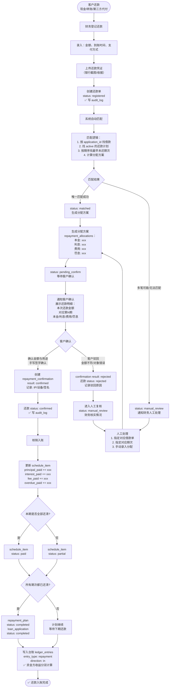

---

## 流程3：逾期 → 罚息计算 → 提醒 → 展期/分期重组 → 补充协议 → 新计划生效

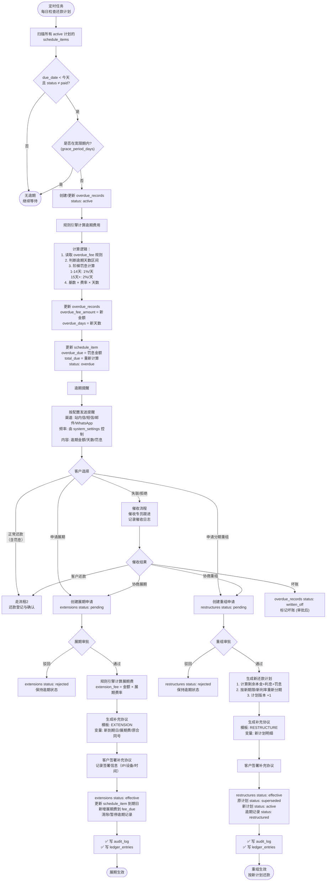

---

## 流程4：资金方入金 → 资金池 → 分配到放款 → 收益统计 → 对账单

```mermaid
flowchart TB
    Start(["资金方划款到指定账户"]) --> A["财务登记入金"]
    A --> A1["选择资金方 → 选择资金账户"]
    A1 --> A2["录入入金金额、时间、渠道"]
    A2 --> A3["上传入金凭证"]
    A3 --> B["创建 capital_inflows<br/>inflow_no 自动生成"]

    B --> C["更新 fund_accounts<br/>balance += 入金金额<br/>total_inflow += 入金金额"]
    C --> D["写入 ledger_entries<br/>entry_type: inflow<br/>direction: in<br/>balance_after: 新余额"]
    D --> DAudit["✅ 写 audit_log"]

    DAudit --> Pool(["💰 资金池/账户余额可用"])

    Pool --> Disb["放款时：<br/>1. 选择资金来源账户<br/>2. 检查余额是否充足<br/>3. 关联 fund_account_id"]
    Disb --> E["创建 disbursement<br/>fund_account_id = 选择的账户<br/>capital_inflow_id = 可关联具体入金"]
    E --> E1["扣减 fund_account<br/>balance -= 放款金额<br/>total_outflow += 放款金额"]
    E1 --> E2["写入 ledger_entries<br/>entry_type: disbursement<br/>direction: out"]

    E2 --> F(["📋 资金使用去向已建立<br/>每笔放款 → 资金来源可追溯"])

    F --> Repay(["客户还款回收"])
    Repay --> G["还款核销后<br/>按分配方案：<br/>本金 → 回归资金池<br/>利息 → 收益<br/>费用 → 收益"]
    G --> ProfitCalc["资金方收益计算<br/>profit_type: interest/fee<br/>gross_amount: 利息+费用总额<br/>share_ratio: 分润比例<br/>share_amount: 资金方分得"]
    ProfitCalc --> ProfitRecord["写入 fund_profit_shares<br/>更新 fund_accounts<br/>total_profit += 分得金额"]
    ProfitRecord --> ProfitLedger["写入 ledger_entries<br/>entry_type: profit_share"]

    ProfitLedger --> Statement(["📊 资金方对账单"])
    Statement --> Report["对账单内容：<br/>入金合计<br/>出金(放款)合计<br/>回款合计<br/>收益合计<br/>当前余额<br/>明细列表"]
    Report --> Export["导出 Excel / PDF"]
    Export --> End(["✅ 对账完成"])
```

---

## 流程5：展期详细子流程（含状态机与规则）

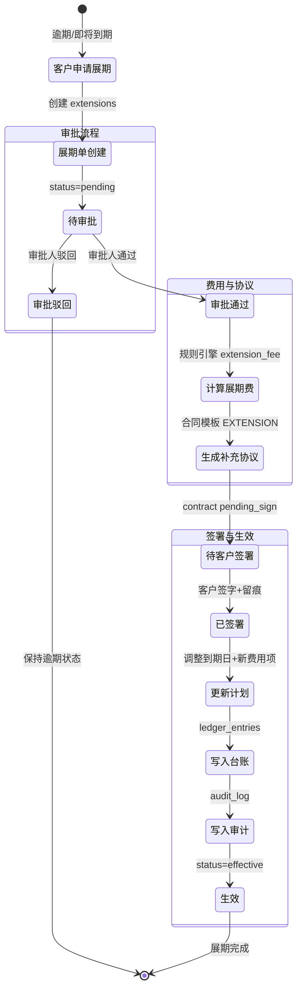

---

## 全部状态机汇总

### 借款申请状态机
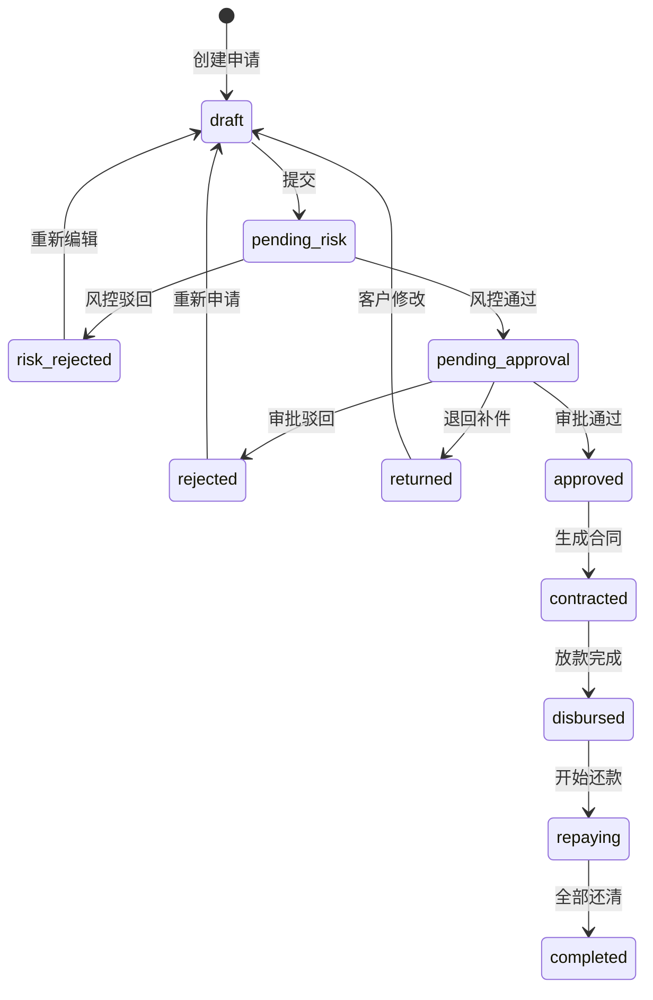

### 合同状态机
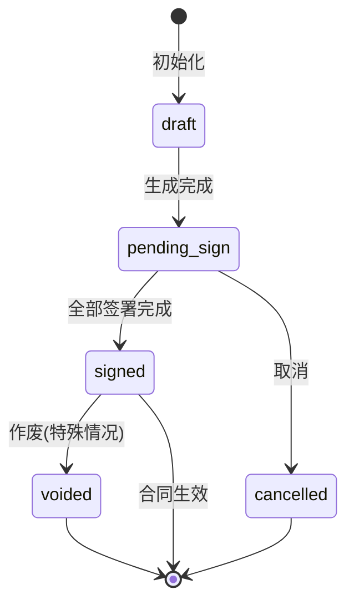

### 放款状态机
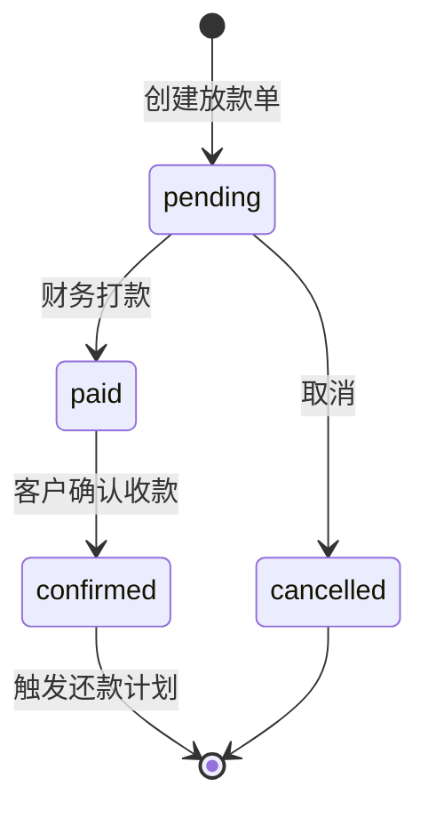

### 还款状态机
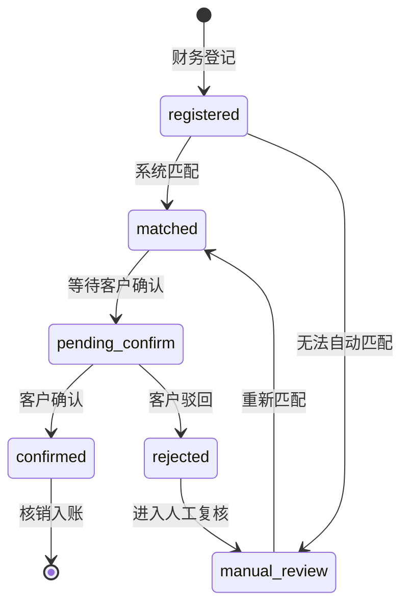

### 还款计划状态机
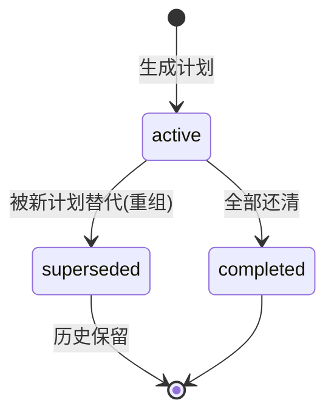

### 展期状态机
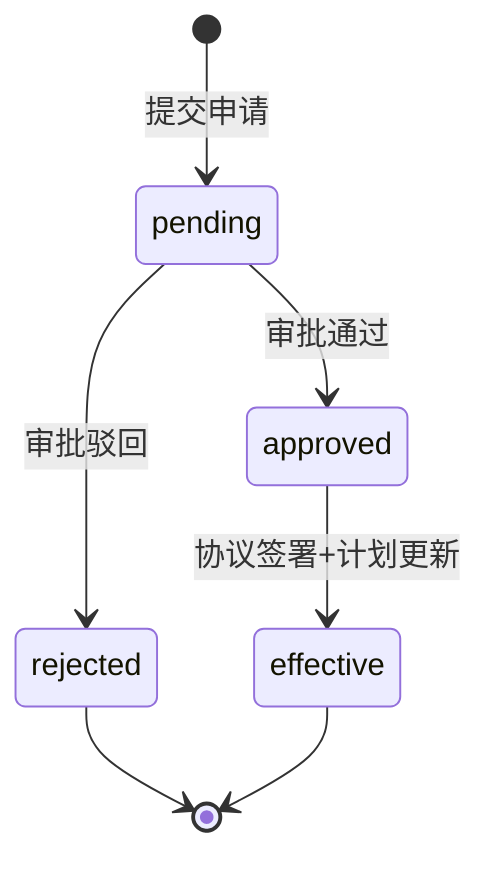

### 逾期记录状态机
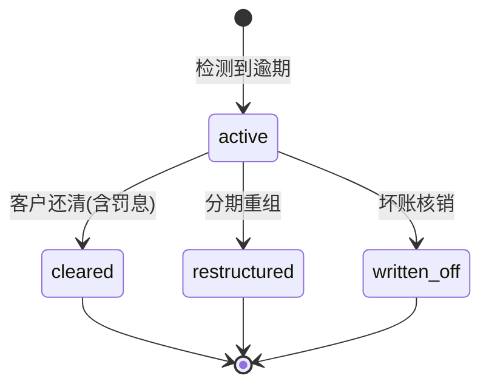

---

## 关键流程检查清单

| 流程 | 审计日志 | 台账记录 | 客户确认 | 资金追溯 | 规则引擎 |
|------|---------|---------|---------|---------|---------|
| 借款申请→审批 | ✅ 每步状态变更 | - | - | - | ✅ 费用试算 |
| 合同生成→签署 | ✅ 签署留痕 | - | ✅ 客户签字 | - | ✅ 模板+变量 |
| 放款 | ✅ 打款记录 | ✅ disbursement | ✅ 确认收款 | ✅ fund→disbursement | - |
| 还款→核销 | ✅ 登记+确认 | ✅ repayment | ✅ 确认金额 | ✅ 核销分配 | - |
| 逾期→罚息 | ✅ 逾期记录 | ✅ overdue | - | - | ✅ 罚息计算 |
| 展期 | ✅ 审批+签署 | ✅ extension fee | ✅ 签署协议 | - | ✅ 展期费 |
| 分期重组 | ✅ 审批+签署 | ✅ 新计划 | ✅ 签署协议 | - | ✅ 重新计算 |
| 资金入金 | ✅ 入金记录 | ✅ inflow | - | ✅ 资金方→账户 | - |

以上流程图与状态机用于开发实现与测试用例设计。所有关键节点均标注了审计日志(audit_log)和台账(ledger_entries)写入点。
