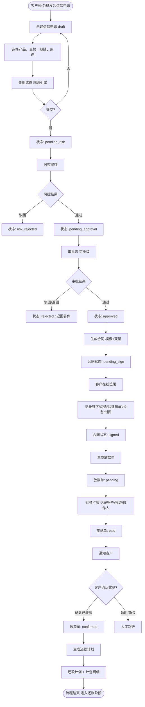
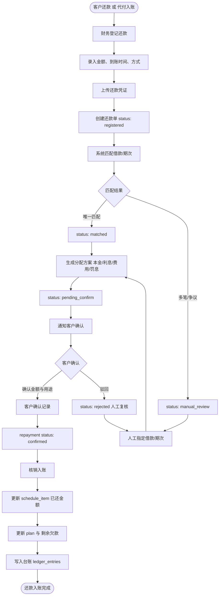
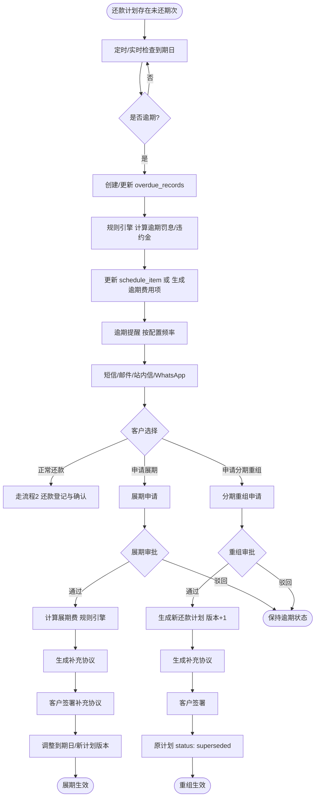
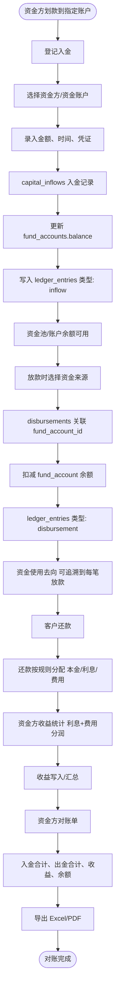
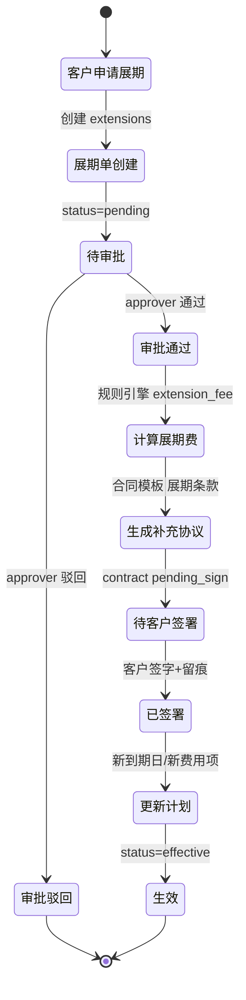

# 借款业务管理系统 - 五大核心流程图

## 流程1：借款申请 → 风控 → 审批 → 合同 → 签字 → 放款 → 客户确认收款 → 还款计划

---

## 流程2：客户还款 → 财务登记 → 凭证 → 匹配 → 客户确认 → 核销 → 更新欠款

---

## 流程3：逾期 → 罚息计算 → 提醒 → 展期/分期重组 → 补充协议 → 新计划生效

---

## 流程4：资金方入金 → 资金池 → 分配到放款 → 收益统计 → 对账单

---

## 流程5：展期详细子流程（含状态与规则）

---

## 状态机汇总（关键实体）

| 实体 | 状态流转 |
|------|----------|
| loan_application | draft → pending_risk → (risk_rejected \| pending_approval) → (rejected \| approved) → contracted → disbursed |
| contract | draft → pending_sign → signed \| cancelled |
| disbursement | pending → paid → confirmed \| cancelled |
| repayment | registered → matched → pending_confirm → (confirmed \| rejected \| manual_review) |
| repayment_plan | active → superseded \| completed |

以上流程图与状态机用于开发实现与测试用例设计。
